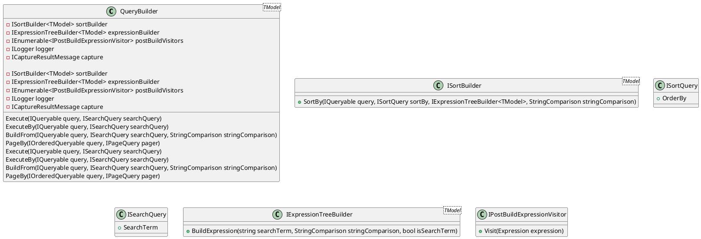
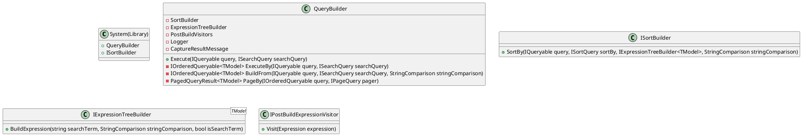

**Documentation**

### Source Files

The following source files are part of the documentation:

1. `OperatorExtensions.cs`
2. `Operators.cs`
3. `QueryBuilder.cs`
4. `SortBuilder.cs`

### Class Diagram



### Component Model

The component model is a high-level representation of the system, showing how the different components interact with each other.



### Sequence Diagram

The sequence diagram shows the interaction between the components when a query is executed.

```plantuml
@startuml
actor Searcher
participant QueryBuilder as QB
participant ISortBuilder as SB
participant IExpressionTreeBuilder as E
participant IPostBuildExpressionVisitor as P
participant System(Library) as System

note "Searcher sends a query to QueryBuilder" as n1
Searcher -> QB: Execute(IQueryable query, ISearchQuery searchQuery)

note "QueryBuilder sends a sort query to ISortBuilder" as n2
QB -> SB: SortBy(IQueryable query, ISortQuery sortBy, E, StringComparison stringComparison)

note "ISortBuilder sends a sorted query to QueryBuilder" as n3
SB -> QB: IOrderedQueryable query

note "QueryBuilder executes the query and sends the result to the System" as n4
QB -> System: IOrderedQueryable query

note "System sends the result back to the Searcher" as n5
System -> Searcher: IOrderedQueryable query
@enduml
```

### Code Comments

The code comments provide additional information about the purpose of each method, class, and interface.

**OperatorExtensions.cs**

```csharp
// Provides extension methods for working with operators

public static class OperatorExtensions
{
    // AsFilter method converts an operator to a filter parameter
    public static FilterParameter AsFilter(this Operators expressionOperator, object? value, ICaptureResultMessage? capture)
    {
        // Switch statement to handle different operators
        switch (expressionOperator)
        {
            case Operators.EqualTo:
                // Return a filter parameter with an equal to value
                return new FilterParameter().And(expressionOperator, value, capture);
            // ...
        }
    }

    // And method combines two filter parameters
    public static FilterParameter And(this FilterParameter filter, Operators expressionOperator, object? value, ICaptureResultMessage? capture)
    {
        // Switch statement to