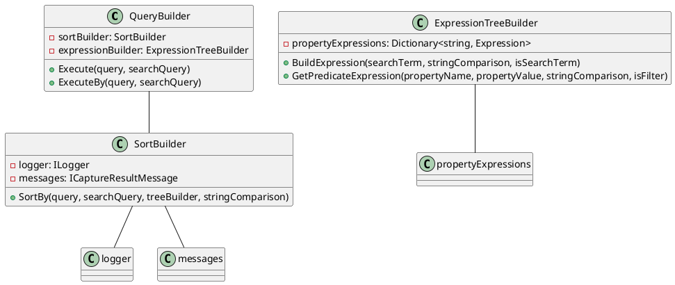

**README**

This repository contains the source code for a .NET Core library that provides a query builder for LINQ queries. The library allows you to build and execute queries based on search, filter, sort, and page criteria.

**Summary**

The library provides a set of classes and interfaces that enable you to define query criteria and execute queries against a data source. The `QueryBuilder` class is the main entry point for building queries, and it provides methods for executing queries against a data source. The `SortBuilder` class is used to sort the results of a query, and it provides methods for determining the sorting order and handling default sorting.

**Design Patterns and Architectural Patterns**

The library uses the following design patterns and architectural patterns:

* **Repository Pattern**: The library uses a repository pattern, where the `QueryBuilder` class acts as a repository for building and executing queries.
* **Decorator Pattern**: The `QueryBuilder` class uses a decorator pattern to wrap around the `SortBuilder` class, allowing for multiple sorting criteria to be applied to a query.
* **Strategy Pattern**: The `SortBuilder` class uses a strategy pattern to determine the sorting order and handle default sorting.

**Component Diagram**

In this component diagram, the `QueryBuilder` class is the main entry point for building queries, and it uses the `SortBuilder` class to sort the results of a query. The `SortBuilder` class uses a logger and message capturer to log and capture messages during the sorting process. The `ExpressionTreeBuilder` class is used to build and retrieve property expressions for sorting and filtering.