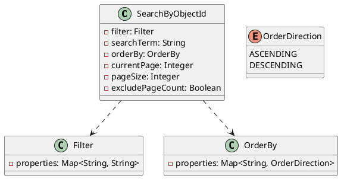
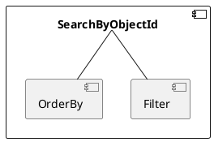

**SearchByObjectId Documentation**

**Overview**

The `SearchByObjectId` API provides a way to search for objects by their object ID. The API accepts a JSON payload that contains filtering, searching, and sorting options.

**SearchQuery.json**

The `SearchQuery.json` file defines the structure of the JSON payload that will be sent to the `SearchByObjectId` API.

```json
{
  "CurrentPage": 123, //This is a 0 based page index
  "PageSize": 456, //This is a number of rows per page
  "ExcludePageCount": false, // [false | true] this will disable total page count ability
  "SearchTerm": "search value", // this will create a, `or` search chain based on trying to match fields to
  "Filter": {
    "Property1": "match term" // if these match search properties they will be used as predicate filters `and` chain
  },
  "OrderBy": {
    "Property2": "Descending" // [Ascending|asc|0|Descending|desc|1] 
  }
}
```

**Filtering**

The `Filter` object can contain one or more filtering options. These options are used to filter the search results based on specific properties.

*   Each filtering option is represented as a property-value pair.
*   The property is the name of the property to filter on.
*   The value can be a single value, a string in the format `*XYZ*`, or a string in the format `XYZ*`.
*   If the value is a single value, the filter will be an equals filter.
*   If the value is a string in the format `*XYZ*`, the filter will be a contains filter.
*   If the value is a string in the format `XYZ*`, the filter will be an endswith filter.
*   If the value is a string in the format `*XYZ`, the filter will be a startswith filter.

**Searching**

The `SearchTerm` property can be used to create an `or` search chain based on the search properties.

*   The search term is the value to search for.
*   The search term will be used to match fields in the `SearchProperties` object.
*   If the search term is not found in the `SearchProperties` object, the filter will be skipped.

**Sorting**

The `OrderBy` object can contain one or more sorting options.

*   Each sorting option is represented as a property-value pair.
*   The property is the name of the property to sort on.
*   The value can be `Ascending`, `Descending`, `asc`, or `desc`.

**Paging**

The `CurrentPage` and `PageSize` properties can be used to paginate the search results.

*   The `CurrentPage` property specifies the current page index.
*   The `PageSize` property specifies the number of rows per page.
*   The `ExcludePageCount` property specifies whether to exclude the total page count.

**Class Diagram**



**Component Model**



**Sequence Diagram**

```plantuml
@startuml
sequence
participant "Client"
participant "SearchByObjectId"
Client -> SearchByObjectId: SearchQuery.json
SearchByObjectId -> SearchByObjectId: Parse SearchQuery.json
SearchByObjectId -> Filter: Filter objects
SearchByObjectId -> OrderBy: Order objects
SearchByObjectId -> OrderBy: Sort objects
SearchByObjectId -> Filter: Apply filters
SearchByObjectId -> Filter: Apply sorting
SearchByObjectId -> SearchByObjectId: Process results
SearchByObjectId -> Client: Search results
```

**Notes**

*   The `SearchByObjectId` API uses a JSON payload to specify filtering, searching, and sorting options.
*   The API accepts a `SearchQuery.json` file that contains the search options.
*   The API uses the `Filter` and `OrderBy` objects to filter and sort the search results.
*   The API uses paging properties `CurrentPage` and `PageSize` to paginate the search results.
*   The API excludes the total page count if the `ExcludePageCount` property is set to `true`.