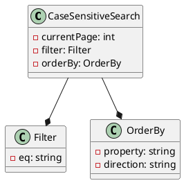
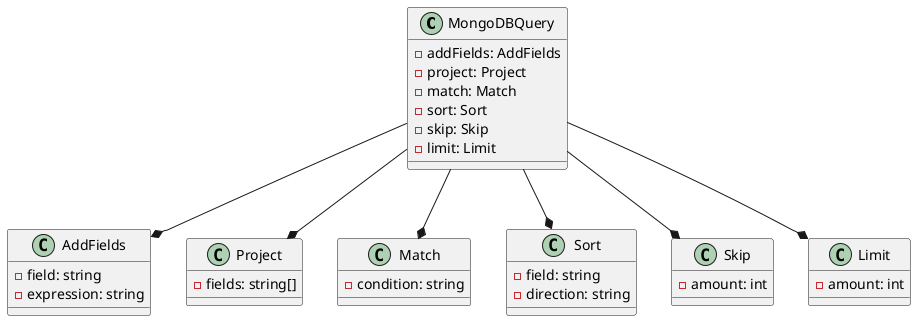
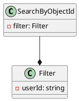
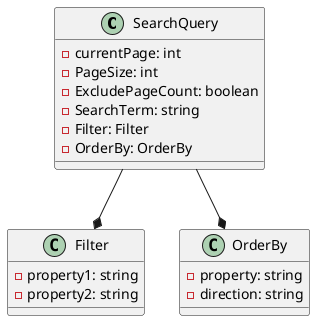

Here is the documentation for the provided source code files, including class diagrams in PlantUML:

**CaseSensitiveSearch.json and DateTimeOffsetQuery.json**

These JSON objects represent filters for a search query. They have the following properties:

* `currentPage`: The current page number (0-based index).
* `filter`: An object that defines the filter criteria.
* `orderBy`: An object that defines the sorting criteria.

Class Diagram:

**mongoquery.md**

This is a MongoDB query that uses various aggregation operators to manipulate the data. It includes the following stages:

* `$addFields`: Adds a new field to the documents.
* `$project`: Projects the fields to include in the output.
* `$match`: Filters the documents based on a condition.
* `$sort`: Sorts the documents based on a field.
* `$skip`: Skips the specified number of documents.
* `$limit`: Limits the number of documents to return.

Class Diagram:

**PagedResult.json**

This JSON object represents a paged result set. It has the following properties:

* `currentPage`: The current page number (0-based index).
* `TotalPageCount`: The total number of pages.
* `TotalRowCount`: The total number of rows.
* `Rows`: An array of objects that represent the paged result set.

Class Diagram:
```plantuml
@startuml
class PagedResult {
  - currentPage: int
  - TotalPageCount: int
  - TotalRowCount: int
  - Rows: object[]
}

PagedResult --* object[] Rows
@enduml
```
**queryexamples.bat**

This is a batch script that demonstrates how to use the search query API. It includes the following examples:

* Unfiltered search.
* Search with a filter term.
* Search with a case-insensitive filter term.
* Search with a paginated result set.

Class Diagram:
```plantuml
@startuml
class QueryExamples {
  - unfiltered: string
  - searchTerm: string
  - caseInsensitive: string
  - paginated: string
}

QueryExamples --* string unfiltered
QueryExamples --* string searchTerm
QueryExamples --* string caseInsensitive
QueryExamples --* string paginated
@enduml
```
**SearchByObjectId.json**

This JSON object represents a search query that filters by object ID. It has the following properties:

* `filter`: An object that defines the filter criteria.

Class Diagram:

**SearchQuery.json**

This JSON object represents a search query. It has the following properties:

* `currentPage`: The current page number (0-based index).
* `PageSize`: The number of rows per page.
* `ExcludePageCount`: A boolean that indicates whether to exclude the page count.
* `SearchTerm`: The search term that defines the filter criteria.
* `Filter`: An object that defines the filter criteria.
* `OrderBy`: An object that defines the sorting criteria.

Class Diagram:

Note that the class diagrams are simplifications of the actual code and are intended to provide a high-level overview of the relationships between