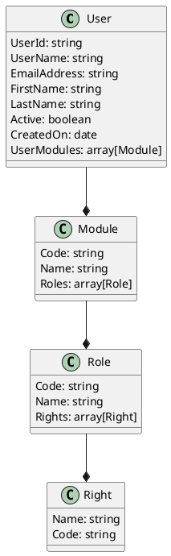
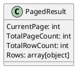

Here is the documentation for the source code in Markdown format, with PlantUML diagrams where reasonable.

**Source Files**

### CaseSensitiveSearch.json

CaseSensitiveSearch.json is a JSON file that defines a search query with a filter that matches the `FirstName` field with the value "jim*" (i.e., starts with "jim").

```json
{
  "currentPage": 0,
  "filter": {
    "FirstName": {
      "eq": "jim*"
    }
  },
  "orderBy": {}
}
```

### DateTimeOffsetQuery.json

DateTimeOffsetQuery.json is a JSON file that defines a search query with a filter that matches the `CreatedOn` field with dates less than 2023-05-23, and orders the results by `CreatedOn`.

```json
{
  "currentPage": 0,
  "filter": {
    "CreatedOn": {
      "lt": "2023-05-23"
    }
  },
  "orderBy": {
    "CreatedOn": 0
  }
}
```

### mongoquery.md

mongoquery.md is a MongoDB query that performs the following operations:

1. Adds a new field `FixedUp` to the result set, which is calculated by adding an offset value to the `createdOn` field.
2. Projects the result set to include the `UserId`, `UserName`, `EmailAddress`, `FirstName`, `LastName`, `Active`, and `UserModules` fields.
3. Applies a condition to the `UserModules` field to only include non-null values.
4. Maps the `UserModules` field to include an array of objects, each containing the `Code`, `Name`, and `Roles` fields.
5. Applies a condition to the `Roles` field to only include non-null values.
6. Maps the `Roles` field to include an array of objects, each containing the `Code`, `Name`, and `Rights` fields.
7. Applies a condition to the `Rights` field to only include non-null values.
8. Maps the `Rights` field to include an array of objects, each containing the `Name` and `Code` fields.
9. Sorts the result set by `LastName`, `FirstName`, and `EmailAddress`.
10. Skips the first 0 elements and limits the result set to 10 elements.

Here is the PlantUML diagram for the query:


### PagedResult.json

PagedResult.json is a JSON file that defines a paged result set with the following properties:

* `CurrentPage`: The current page number (0-based index).
* `TotalPageCount`: The total number of possible pages.
* `TotalRowCount`: The total row count based on the predicate before paging.
* `Rows`: An array of objects that match the query filter and projection.

Here is the PlantUML diagram for the PagedResult.json structure:


### queryexamples.bat

queryexamples.bat is a batch file that demonstrates how to use the API to perform various queries, such as:

* Unfiltered query
* Search query with a specific term
* Search query with a case-sensitive term
* Search query with a page number and page size

Here are the queries:

* Unfiltered query: `curl https://localhost:7192/api/users`
* Search query with a specific term: `curl https://localhost:7192/api/users?SearchTerm=Allen`
* Search query with a case-sensitive term: `curl https://localhost:7192/api/users?SearchTerm=Ji*`
* Search query with a page number and page size: `curl https://localhost:7192/api/users?CurrentPage=1&PageSize=20`

I hope this documentation helps! Let me know if you have any further requests.