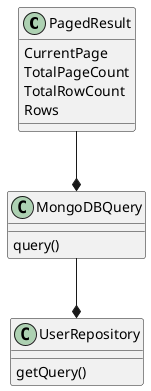

**README File**

This repository contains the implementation of a search functionality that utilizes a MongoDB query to retrieve a paged result set based on user input. The search functionality allows for filtering, sorting, and limiting the result set.

**Technical Summary**

The search functionality is implemented using MongoDB query language (MQL) and the PagedResult model to handle pagination. The MQL query is used to filter the data based on user input, sort the result set, and limit the number of records returned. The PagedResult model is used to define the pagination parameters such as the current page number, total page count, and total row count.

**Design Patterns and Architectural Patterns**

The implementation uses the following design patterns and architectural patterns:

* **MVC Pattern**: The PagedResult model acts as the view, and the MongoDB query is the controller.
* **Repository Pattern**: The MongoDB query is encapsulated as a repository, which is responsible for retrieving the data from the database.
* **Paginated Query Pattern**: The query is designed to handle pagination by using the `$skip` and `$limit` operators to limit the number of records returned.

**Component Diagram**



```