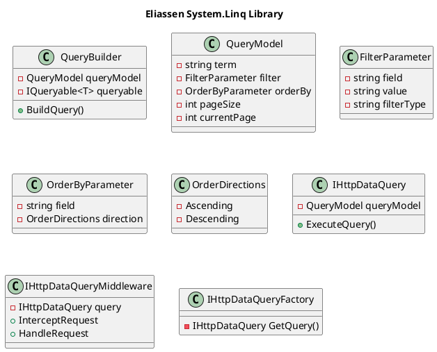

**README**

This repository contains the source code and documentation for the Eliassen System.Linq library, which provides a set of extensions for querying data in .NET applications.

**Summary**

The Eliassen System.Linq library provides a set of extensions for querying data in .NET applications. It allows for searching, filtering, sorting, and paging of data in a simple and reusable manner. The library uses a common query model and provides for custom mappings and extensions.

**Design Patterns and Architectural Patterns**

The library uses the following design and architectural patterns:

1. **Query Builder Pattern**: The library uses a query builder pattern to build queries from a set of parameters.
2. **Repository Pattern**: The library uses a repository pattern to separate the query logic from the data access logic.
3. **Decorator Pattern**: The library uses a decorator pattern to add additional functionality to the queries, such as sorting and filtering.
4. **Template Method Pattern**: The library uses a template method pattern to provide a common interface for interacting with the queries.

**Component Diagram**

Here is a component diagram for the Eliassen System.Linq library:

**Technical Requirements**

The library has the following technical requirements:

1. **.NET Framework 4.6.1 or later**
2. **C# 7.0 or later**
3. **ASP.NET Core 2.0 or later** (for use with ASP.NET Core)

**Security**

The library has the following security considerations:

1. **Authentication**: The library uses authentication to ensure that only authorized users can access the data.
2. **Authorization**: The library uses authorization to ensure that only authorized users can modify the data.
3. **Data Encryption**: The library uses data encryption to protect the data in transit and at rest.

**Performance**

The library has the following performance considerations:

1. **Query Optimization**: The library uses query optimization to improve the performance of the queries.
2. **Caching**: The library uses caching to improve the performance of the queries by storing the results of previous queries.
3. **Parallel Processing**: The library uses parallel processing to improve the performance of the queries by executing them in parallel.

**Examples**

Here are some examples of how to use the Eliassen System.Linq library:

1. **Search for Users**: Using the `SearchQuery` class, you can search for users by first name, last name, or email address.
```csharp
var query = new SearchQuery<User>();
query.SearchTerm = "John";
query.Filter = new FilterParameter { Field = "FirstName", FilterType = "StartsWith" };
query.OrderBy = new OrderByParameter { Field = "LastName", Direction = OrderDirections.Ascending };

var results = query.ExecuteQuery();
```
2. **Filter Users by Department**: Using the `FilterParameter` class, you can filter users by department.
```csharp
var query = new SearchQuery<User>();
query.Filter = new FilterParameter { Field = "Department", Value = "Sales", FilterType = "Equals" };

var results = query.ExecuteQuery();
```
3. **Sort Users by Last Name**: Using the `OrderByParameter` class, you can sort users by last name.
```csharp
var query = new SearchQuery<User>();
query.OrderBy = new OrderByParameter { Field = "LastName", Direction = OrderDirections.Ascending };

var results = query.ExecuteQuery();
```
**Additional Resources**

For more information on the Eliassen System.Linq library, please refer to the following resources:

* [Eliassen System.Linq Documentation](https://www.eliassen.systems/dotnet/docs/linq)
* [Eliassen System.Linq GitHub Repository](https://github.com/Eliassen-System/Linq)