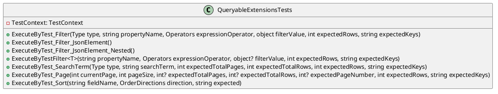

**QueryableExtensionsTests Documentation**
============================================

### Overview

This documentation provides an overview of the `QueryableExtensionsTests` class, which contains various test methods for testing queryable extensions.

### Class Diagram



### Component Model

```plantuml
@startuml
component QueryableExtensionsTests {
  [TestClass]
  QueryableExtensionsTests
  -- TestContext
  component TestContext {
    -- TestMethods
  }
  -- IDataTestMethod
  ExecuteByTest_Filter
  ExecuteByTest_Filter_JsonElement
  ExecuteByTest_Filter_JsonElement_Nested
  ExecuteByTestFilter
  ExecuteByTest_SearchTerm
  ExecuteByTest_Page
  ExecuteByTest_Sort
}

@enduml
```

### Sequence Diagram

```plantuml
@startuml
 participant QueryableExtensionsTests as "QueryableExtensionsTests"
 participant TestContext as "TestContext"
 participant TestDataBuilder as "TestDataBuilder"

 note "Constructor" as "ctor"
 QueryableExtensionsTests->TestDataBuilder: GetTestData<T>(seed)

 note "Factory" as "fact"
 QueryableExtensionsTests->TestDataBuilder: Factory<T>(index)

 note "AsQueryable" as "asq"
 QueryableExtensionsTests->TestDataBuilder: AsQueryable<T>()

 QueryableExtensionsTests->TestContext: ExecuteByTest_Filter
 TestContext->TestDataBuilder: GetTestData<T>(seed)
 TestDataBuilder->Query: AsQueryable<T>()
 QueryableExtensionsTests->TestContext: ExecuteByTest_Filter

 QueryableExtensionsTests->TestContext: ExecuteByTest_Filter_JsonElement
 TestContext->TestDataBuilder: GetTestData<T>(seed)
 TestDataBuilder->Query: AsQueryable<T>()
 QueryableExtensionsTests->TestContext: ExecuteByTest_Filter_JsonElement

 QueryableExtensionsTests->TestContext: ExecuteByTest_SearchTerm
 TestContext->TestDataBuilder: GetTestData<T>(seed)
 TestDataBuilder->Query: AsQueryable<T>()
 QueryableExtensionsTests->TestContext: ExecuteByTest_SearchTerm

 QueryableExtensionsTests->TestContext: ExecuteByTest_Page
 TestContext->TestDataBuilder: GetTestData<T>(seed)
 TestDataBuilder->Query: AsQueryable<T>()
 QueryableExtensionsTests->TestContext: ExecuteByTest_Page

 QueryableExtensionsTests->TestContext: ExecuteByTest_Sort
 TestContext->TestDataBuilder: GetTestData<T>(seed)
 TestDataBuilder->Query: AsQueryable<T>()
 QueryableExtensionsTests->TestContext: ExecuteByTest_Sort

@enduml
```