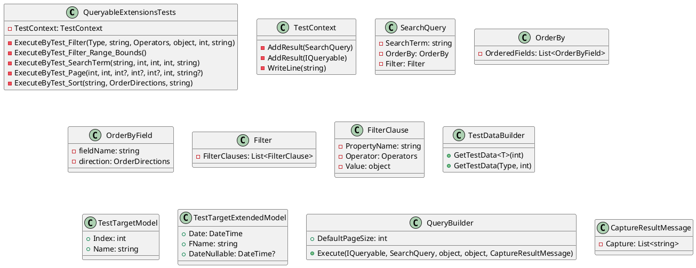

**Executable UML Class Diagram**

Here is a generated PlantUML class diagram for the provided code:

**Note**: This diagram is generated based on the provided code and might not be 100% accurate. Some information, such as the `TestContext` and `CaptureResultMessage` classes, might not be fully represented.

**Explanation**:

The diagram shows the relationships between the classes in the code. The `QueryableExtensionsTests` class contains several methods that test various aspects of the `QueryBuilder` class. The `TestContext` class is used to add results and write lines to the console. The `SearchQuery` class represents a search query, containing a search term, order by clause, and filter clause.

The `OrderBy` class represents the order by clause, which contains a list of ordered fields. Each `OrderByField` has a property name and direction. The `Filter` class represents the filter clause, which contains a list of filter clauses. Each `FilterClause` has a property name, operator, and value.

The `TestDataBuilder` class is used to create test data, and the `TestTargetModel` and `TestTargetExtendedModel` classes are examples of the data being queried.

The `QueryBuilder` class is the core class responsible for executing queries. It takes an `IQueryable` object and a `SearchQuery` object as input and returns a result. The `DefaultPageSize` variable is used to set the default page size for queries.

The `CaptureResultMessage` class is used to capture the results of queries and write them to the console.