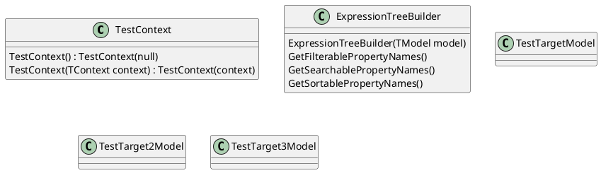
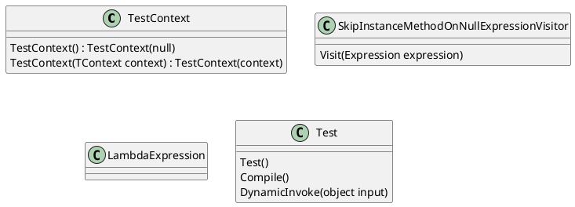
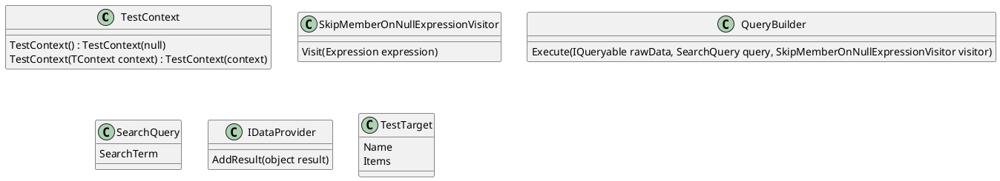
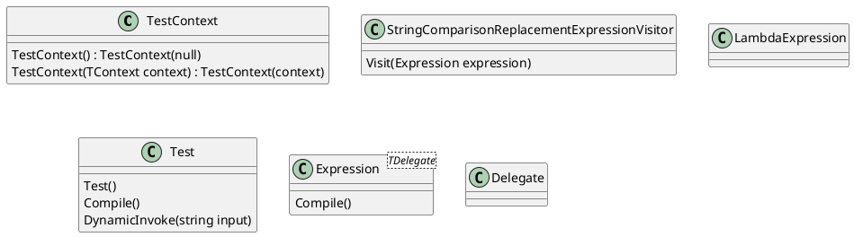

Here is the generated documentation for the source code files:

**ExpressionTreeBuilderTests.cs**

This test class contains a set of unit tests for the ExpressionTreeBuilder class. The tests cover different scenarios and verify the correctness of the methods.

### Class Diagram

**SkipInstanceMethodOnNullExpressionVisitorTests.cs**

This test class contains a set of unit tests for the SkipInstanceMethodOnNullExpressionVisitor class. The tests cover different scenarios and verify the correctness of the visitor's implementation.

### Class Diagram

**SkipMemberOnNullExpressionVisitorTests.cs**

This test class contains a set of unit tests for the SkipMemberOnNullExpressionVisitor class. The tests cover different scenarios and verify the correctness of the visitor's implementation.

### Class Diagram

**StringComparisonReplacementExpressionVisitorTests.cs**

This test class contains a set of unit tests for the StringComparisonReplacementExpressionVisitor class. The tests cover different scenarios and verify the correctness of the visitor's implementation.

### Class Diagram

Note that the class diagrams are simplified and do not show all the methods and properties of the classes. They are intended to provide a general overview of the classes and their relationships.