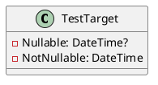

Here is the documentation for the `TestTarget.cs` file, including a class diagram in PlantUML:

**Class Documentation:**

**TestTarget Class**

Namespace: Eliassen.System.Tests.Linq.Expressions.TestTargets

Summary:
The `TestTarget` class is a test target class used for testing LINQ expressions.

Properties:

* **Nullable**: A nullable `DateTime` property that can be null.
* **NotNullable**: A non-nullable `DateTime` property that must always have a value.

**Class Diagram (PlantUML):**

**Diagram Explanation:**

The class diagram shows the `TestTarget` class with two properties: `Nullable` and `NotNullable`. The `Nullable` property is a nullable `DateTime` property, represented by a question mark (`?`) in the type notation. The `NotNullable` property is a non-nullable `DateTime` property, represented by the absence of a question mark.

This diagram provides a simple and concise representation of the `TestTarget` class structure, making it easier to understand the relationships and properties of the class.