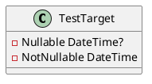

**TestTarget.cs Documentation**

### Description

The `TestTarget` class is a simple test class used to demonstrate LINQ expression testing. It has two properties: `Nullable` and `NotNullable`, both of which are of type `DateTime` with a nullable and non-nullable aspect, respectively.

### Class Diagram



### Component Model

There is no component model for this class, as it is a simple test class and does not interact with any other components or systems.

### Sequence Diagram

```plantuml
@startuml
participant TestTarget as tt
note "Call to TestTarget's property or method" as note
sequenceDiagram
    participant tt->>note: Get or set Nullable or NotNullable
    note->>tt: Returns or sets the value
    alt Nullable
        note->>tt: Returns DateTime?
    else
        note->>tt: Returns DateTime
    end
@enduml
```

This sequence diagram outlines the interaction with the `TestTarget` class, showing how a caller can get or set the `Nullable` or `.NotNullabl`e properties. The diagram also highlights the fact that the `Nullable` property returns a `DateTime?` (a nullable DateTime), while the `NotNullable` property returns a non-nullable `DateTime`.