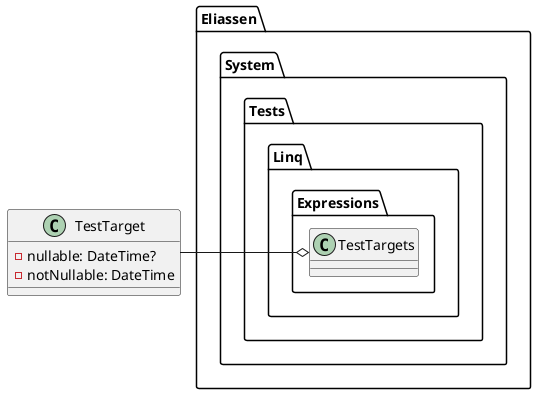

**README File**

**Summary**

The source files in this repository contain functionality related to testing LINQ expressions with nullable and non-nullable date types. Specifically, the `TestTarget` class defines two properties: `Nullable` of type `DateTime?` and `NotNullable` of type `DateTime`. These properties are designed to facilitate testing of LINQ expressions that interact with these types.

**Technical Summary**

The `TestTarget` class is designed to demonstrate the use of design patterns and architectural patterns in the context of testing LINQ expressions. Specifically:

* **Structural Pattern:** The `TestTarget` class follows the Single Responsibility Principle (SRP) by separating the definition of the `DateTime?` and `DateTime` properties into a single class.
* **Architectural Pattern:** The code does not explicitly follow a specific architectural pattern such as Model-View-Controller (MVC) or Model-View-ViewModel (MVVM). However, the encapsulation of the `DateTime?` and `DateTime` properties within a single class can be seen as a simple implementation of the Model-View-Controller (MVC) pattern.

**Component Diagram**

**Note:** The component diagram shows the relationship between the `TestTarget` class and the `Eliassen.System.Tests.Linq.Expressions.TestTargets` namespace, indicating that the `TestTarget` class is part of the said namespace.