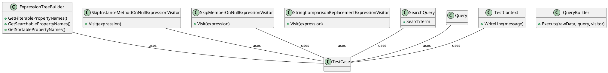

**README**

This repository contains a set of unit tests for the Eliassen.Linq.Expressions project, which provides functionality for working with LINQ expressions.

**Summary**

The tests cover the following functionality:

1. `ExpressionTreeBuilderTests`: Tests the `ExpressionTreeBuilder` class, which provides methods for getting filterable, searchable, and sortable property names from a model.
2. `SkipInstanceMethodOnNullExpressionVisitorTests`: Tests the `SkipInstanceMethodOnNullExpressionVisitor` class, which visits expressions and skips instance methods on null expressions.
3. `SkipMemberOnNullExpressionVisitorTests`: Tests the `SkipMemberOnNullExpressionVisitor` class, which visits expressions and skips member assignments on null expressions.
4. `StringComparisonReplacementExpressionVisitorTests`: Tests the `StringComparisonReplacementExpressionVisitor` class, which visits expressions and replaces string comparison operators with Culture-Invariant comparisons.

**Technical Summary**

The design patterns and architectural patterns used in these files include:

1. **C#**: The tests are written in C# and utilize the .NET Framework.
2. **Test-Driven Development (TDD)**: The tests are written using the Test-Driven Development (TDD) approach, where tests are written before the implementation code is written.
3. **Behavior-Driven Development (BDD)**: The tests use a behavior-driven development (BDD) styling, where the tests are written in a natural language style using keywords like "Given", "When", and "Then".
4. **Dependency Injection (DI)**: The tests use Dependency Injection (DI) to inject dependencies into the classes under test.

**Component Diagram**

Here is a component diagram for the Eliassen.Linq.Expressions project, generated using PlantUML:
```

```