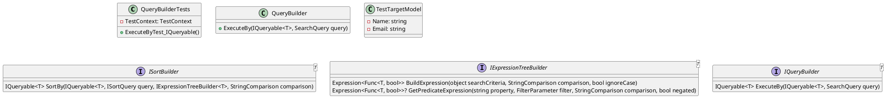
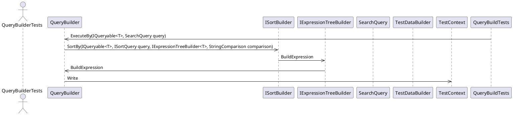

**QueryBuilderTests Documentation**

**Overview**
===============

This document provides an overview of the `QueryBuilderTests` class and its associated source code. The class is responsible for testing the functionality of the `QueryBuilder` class, which is used to execute queries on a data source.

**Class Diagram**
================



**Component Model**
================

```plantuml
@startuml
component "QueryBuilderTests" {
  component "QueryBuilder"
  component "TestTargetModel"
}

component "QueryBuilder" {
  interface "ISortBuilder"
  interface "IExpressionTreeBuilder"
}

component "ISortBuilder" {
  operation "SortBy"
}

component "IExpressionTreeBuilder" {
  operation "BuildExpression"
  operation "GetPredicateExpression"
}

component "TestTargetModel" {
  attribute "Name"
  attribute "Email"
}

@enduml
```

**Sequence Diagram**
================



**Test Description**
--------------------

The `ExecuteByTest_IQueryable` method tests the `QueryBuilder` class by executing a query on a test data source. The test data source is created using the `TestDataBuilder` class, which generates a list of `TestTargetModel` objects. The query is defined in the `SearchQuery` class, which contains the search term, filter, and order by criteria.

The test method sets up the query builder and executes the query using the `ExecuteBy` method. The query result is then checked to ensure it is not null. The test also captures any logging messages and writes them to the console.

**Test Context**
----------------

The `TestContext` class is used to provide context for the test. It contains methods for writing output to the console and for capturing logging messages.

**Test Categories**
-------------------

The test is categorized as a unit test and belongs to the "Unit" category.

**Dependences**
--------------

The `QueryBuilderTests` class depends on the following classes and interfaces:

* Eliassen.System.Linq.Expressions
* Eliassen.System.Linq.Search
* Eliassen.System.ResponseModel
* Eliassen.System.Tests.Linq.TestTargets
* Eliassen.TestUtilities
* Microsoft.VisualStudio.TestTools.UnitTesting
* Moq
* System.Linq
* System.Linq.Expressions