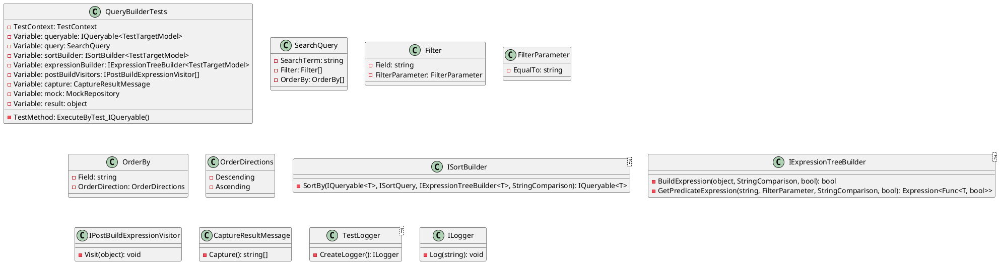

**QueryBuilderTests.cs Documentation**

### Class Diagram in PlantUML

### Method Documentation

```csharp
[TestClass]
public class QueryBuilderTests
```
The `QueryBuilderTests` class contains a single test method `ExecuteByTest_IQueryable()` that tests the `QueryBuilder<T>` class.

### ExecuteByTest_IQueryable Method
```csharp
[TestMethod]
[TestCategory(TestCategories.Unit)]
public void ExecuteByTest_IQueryable()
```
The `ExecuteByTest_IQueryable` method tests the `QueryBuilder<T>` class by creating a `SearchQuery` object and executing it using the `QueryBuilder<T>` class. The method checks the results of the query and asserts that the `CaptureResultMessage` object contains the expected output.

### Variables and Properties

| Variable/Property | Description |
| --- | --- |
| `queryable` | The IQueryable instance to be used for testing. |
| `query` | The SearchQuery instance to be used for testing. |
| `sortBuilder` | The ISortBuilder instance to be used for testing. |
| `expressionBuilder` | The IExpressionTreeBuilder instance to be used for testing. |
| `postBuildVisitors` | The IPostBuildExpressionVisitor array to be used for testing. |
| `capture` | The CaptureResultMessage instance to capture the query results. |
| `mock` | The MockRepository instance to create mock objects. |
| `result` | The result of the executed query. |

### Mocked Objects

The following objects are mocked:

* `sortBuilder`: Mocked using Moq to return the expected result for the `SortBy` method.
* `expressionBuilder`: Mocked using Moq to return the expected result for the `BuildExpression` and `GetPredicateExpression` methods.
* `logger`: Mocked using Moq to create a TestLogger object.

### Test Logic

1. Create a `SearchQuery` object with the expected filter and order by expressions.
2. Create a `QueryBuilder<T>` object with the mocked `sortBuilder`, `expressionBuilder`, and `logger` objects.
3. Execute the query using the `QueryBuilder<T>` object and capture the result using the `capture` object.
4. Assert that the `result` object is not null.
5. Assert that the `capture` object contains the expected output.

### Notes

* The `SortBy` method is mocked to return the expected result for the `queryable` instance.
* The `BuildExpression` method is mocked to return a boolean value indicating whether the expression is valid.
* The `GetPredicateExpression` method is mocked to return an expression that filters the `TestTargetModel` instances based on the `Name` and `DoesntExist` properties.
* The `CaptureResultMessage` object is used to capture the query results and assert their correctness.
* The `TestLogger` object is used to create a logger instance that logs the query execution results.