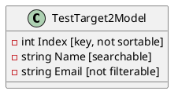
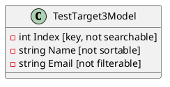
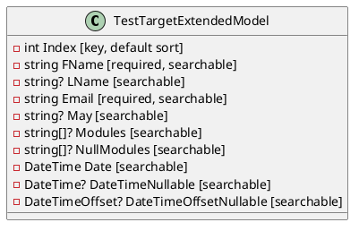
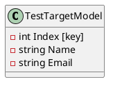
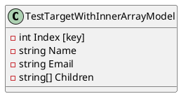

# Documentation for Eliassen.System.Tests.Linq.TestTargets

## Overview

This project contains test models for the Eliassen System, a LINQ-based search system. The models are used to test the search functionality and other features of the system.

## Classes

### TestTarget2Model

The TestTarget2Model class represents a basic model with a primary key, a searchable string property, and a non-filterable string property.

### TestTarget3Model

The TestTarget3Model class represents a basic model with a primary key, but with a non-searchable property and a non-sortable property.

### TestTargetExtendedModel

The TestTargetExtendedModel class represents a more advanced model with multiple searchable properties, including a required property, a nullable property, and an array property. It also includes two date and time properties with nullable types.

### TestTargetModel

The TestTargetModel class represents a basic model with a primary key and two simple properties.

### TestTargetWithInnerArrayModel

The TestTargetWithInnerArrayModel class represents a model with an array property that contains inner strings.