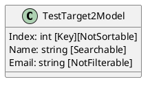
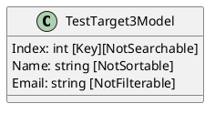
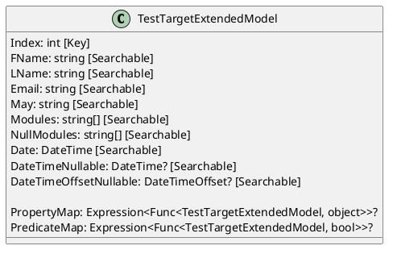
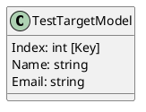

Here is the documentation for the provided source code files, including class diagrams in PlantUML:

**TestTarget2Model:**

```csharp
[Searchable("Fake")]
public class TestTarget2Model
{
    [Key]
    [NotSortable]
    public int Index { get; set; }

    [Searchable]
    public string Name { get; set; } = default!;

    [NotFilterable]
    public string Email { get; set; } = default!;
}
```

Class Diagram:


**TestTarget3Model:**

```csharp
public class TestTarget3Model
{
    [Key]
    [NotSearchable]
    public int Index { get; set; }

    [NotSortable]
    public string Name { get; set; } = default!;

    [NotFilterable]
    public string Email { get; set; } = default!;
}
```

Class Diagram:


**TestTargetExtendedModel:**

```csharp
[Searchable(FirstNameLastName, LastNameFirstName)]
public class TestTargetExtendedModel
{
    public static readonly DateTime BaseDate = new(2020, 1, 1);

    public TestTargetExtendedModel(int index)
    {
        // ... constructor code ...
    }

    [Key]
    public int Index { get; set; }

    [Searchable]
    public required string FName { get; set; }

    [Searchable]
    public string? LName { get; set; }

    [Searchable]
    public required string Email { get; set; }

    [Searchable]
    public string? May { get; set; }

    [Searchable]
    public string[]? Modules { get; set; }

    [Searchable]
    public string[]? NullModules { get; set; }

    [Searchable]
    public DateTime Date { get; set; }

    public DateTime? DateTimeNullable { get; set; }
    public DateTimeOffset? DateTimeOffsetNullable { get; set; }

    public static Expression<Func<TestTargetExtendedModel, object>>? PropertyMap(string key)
    {
        // ... PropertyMap code ...
    }

    public static Expression<Func<TestTargetExtendedModel, bool>>? PredicateMap(string key, object value)
    {
        // ... PredicateMap code ...
    }
}
```

Class Diagram:


**TestTargetModel:**

```csharp
public class TestTargetModel
{
    public TestTargetModel(int index)
    {
        Index = index;
        Name = $"{nameof(Name)}{index}";
        Email = $"{nameof(Email)}{index:000}@domain.com";
    }

    [Key]
    public int Index { get; set; }

    public string Name { get; set; }

    public string Email { get; set; }
}
```

Class Diagram:


**TestTargetWithInnerArrayModel:**

```csharp
public class TestTargetWithInnerArrayModel
{
    public TestTargetWithInnerArrayModel(int index)
    {
        Index = index;
        Name = $"{nameof(Name)}{index}";
        Email = $"{nameof(Email)}{index:000}@domain.com";
        Children = Enumerable.Range(index / 100 % 10, index % 10).Select(i => $"Child{i:000}").ToArray();
    }

    [Key]
    public int Index { get; set; }

    public string Name { get; set; }

    public string Email { get; set; }

    public string[] Children { get; set; }
}
```

Class Diagram:
```plantuml
@startuml
class TestTargetWithInnerArrayModel {
  Index: int [Key]
  Name: string
  Email: