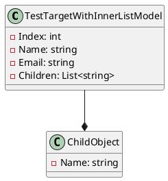

**README File**

This repository contains a set of C# source files that demonstrate the functionality of a test target classes and their usage in LINQ queries. The following summary provides an overview of the related functionality and technical details of the design patterns and architectural patterns used in the files.

**Summary**

The files in this repository define a set of test target classes that mimic real-world entities with complex relationships. The `TestTargetWithInnerListModel` class, for example, represents a test target that has an inner list of child objects. This class is designed to be used in LINQ queries to test the functionality of various query operators.

**Technical Summary**

The design pattern used in this repository is the [Data Transfer Object (DTO)](https://en.wikipedia.org/wiki/Data_transfer_object), which is a pattern used to transfer data between processes or systems. The `TestTargetWithInnerListModel` class is a DTO that encapsulates the data of a test target and its inner list of child objects.

The architectural pattern used in this repository is the [Model-View-Controller (MVC)](https://en.wikipedia.org/wiki/Model–view–controller) pattern, which is a widely used pattern in software development. The MVC pattern separates the concerns of the application into three interconnected components: the Model represents the data, the View represents the user interface, and the Controller handles the interactions between the Model and the View.

In the above diagram, `TestTargetWithInnerListModel` is a class that represents the test target with an inner list of `ChildObject` instances. The `--*` notation represents the one-to-many relationship between `TestTargetWithInnerListModel` and `ChildObject`.

**Files**

The repository contains a single source file, `TestTargetWithInnerListModel.cs`, which defines the `TestTargetWithInnerListModel` class.

Note: The PlantUML code above is a simple diagram and can be further customized to show more details or relationships between classes.