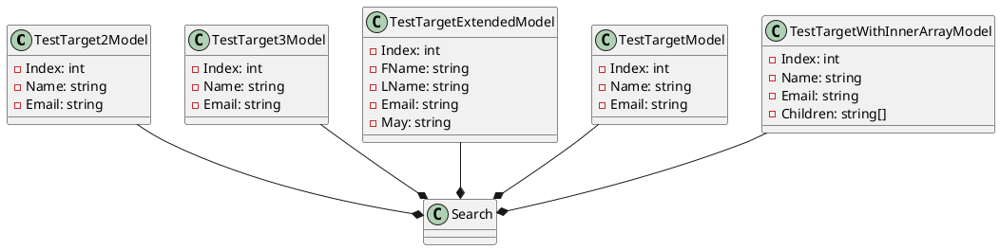

**README.md**

This repository contains a collection of C# classes that demonstrate various search-related functionality. The classes are designed to test the search capabilities of the Eliassen System's search module.

The classes are organized into three categories: `TestTarget2Model`, `TestTarget3Model`, and `TestTargetExtendedModel`. Each class represents a different scenario for testing search functionality.

The main functionality provided by these classes includes:

* Attribute-based searching and filtering
* Customizable property mapping for searching and filtering
* Support for null string properties
* Support for array properties
* Support for nested array properties

Here is a technical summary of the design patterns and architectural patterns used in these classes:

* The classes use the Repository pattern to encapsulate the data access logic.
* The classes use the Factory pattern to create instances of the models.
* The classes use the Strategy pattern to customize the searching and filtering behavior.

Here is a PlantUML diagram that illustrates the relationships between the classes:
```
