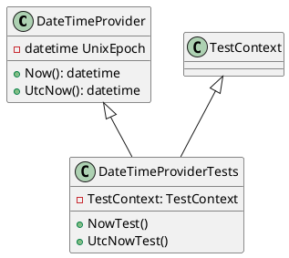
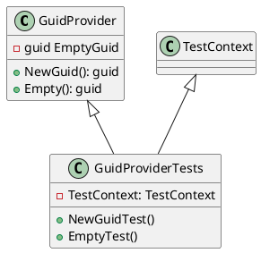

**DateTimeProviderTests.cs Documentation**

### Class Diagram

### Class Description

`DateTimeProvider`: A provider that returns the current date and time in the system's local time zone.

**Methods**

* `Now()`: Returns the current date and time in the system's local time zone.
* `UtcNow()`: Returns the current date and time in UTC.

`DateTimeProviderTests`: A test class for `DateTimeProvider`.

**Methods**

* `NowTest()`: Tests the `Now()` method by verifying that the returned date and time is not earlier than the current time.
* `UtcNowTest()`: Tests the `UtcNow()` method by verifying that the returned date and time is not earlier than the current time in UTC.

### Test Context

The `TestContext` class is used to store information about the test, such as the test method name and the user who ran the test.

### Keywords

* `TestContext`: used to store test information
* `DateTimeProvider`: provides current date and time
* `Now()`: returns current date and time in local time zone
* `UtcNow()`: returns current date and time in UTC

---

**GuidProviderTests.cs Documentation**

### Class Diagram

### Class Description

`GuidProvider`: A provider that generates and returns unique GUIDs.

**Methods**

* `NewGuid()`: Returns a new, unique GUID.
* `Empty()`: Returns an empty GUID.

`GuidProviderTests`: A test class for `GuidProvider`.

**Methods**

* `NewGuidTest()`: Tests the `NewGuid()` method by verifying that the returned GUID is not empty.
* `EmptyTest()`: Tests the `Empty()` method by verifying that the returned GUID is indeed empty.

### Test Context

The `TestContext` class is used to store information about the test, such as the test method name and the user who ran the test.

### Keywords

* `TestContext`: used to store test information
* `GuidProvider`: provides unique GUIDs
* `NewGuid()`: returns a new, unique GUID
* `Empty()`: returns an empty GUID