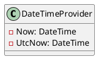

# DateTimeProvider and GuidProvider Documentation

## Overview

This documentation provides an overview of the `DateTimeProvider` and `GuidProvider` classes, which provide functionality for working with dates and times, and globally unique identifiers (GUIDs), respectively.

## Classes

### DateTimeProvider

The `DateTimeProvider` class provides methods for getting the current date and time, as well as a specific UTC date and time.

