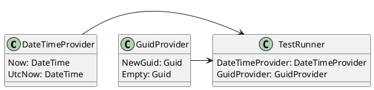

**README**

**Summary**

The provided source files contain test classes for two date and time value providers: `DateTimeProvider` and `GuidProvider`. The `DateTimeProvider` class provides methods to retrieve the current date and time, as well as the UTC date and time. The `GuidProvider` class provides methods to generate a new GUID and retrieve an empty GUID.

**Technical Summary**

The `DateTimeProvider` and `GuidProvider` classes demonstrate the use of Singleton design pattern to provide a globally accessible instance of the provider. This enables the clients of these classes to retrieve the date and time values, and GUIDs, without having to create a new instance of the provider.

**Component Diagram**

This component diagram shows the relationships between the `DateTimeProvider`, `GuidProvider`, and `TestRunner` components. The `TestRunner` component uses instances of `DateTimeProvider` and `GuidProvider` to execute tests. The `DateTimeProvider` and `GuidProvider` components demonstrate the use of Singleton design pattern to provide globally accessible instances.