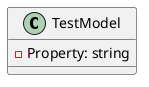
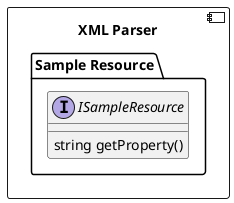

**Sample Resource Documentation**

### Overview

The Sample Resource project is a simple XML-based configuration file that represents a test model containing a single property with a greeting message.

### File Structure

The project consists of a single XML file, `SampleResource.xml`, which contains the following structure:

```
[TestModel]
  <Property>Hello World!</Property>
</TestModel>
```

### Class Diagram



### Component Model

The component model for the Sample Resource project is a simple XML parser that reads the `SampleResource.xml` file and provides an interface to access the `Property` element.



### Sequence Diagram

Here is a sequence diagram showing the interaction between the XML parser and the `ISampleResource` interface:

```plantuml
@startuml
participant "XML Parser"
participant "ISampleResource"

note "xml file" as n1
note "greet method" as n2

XML Parser->>ISampleResource: Load SampleResource.xml
activate ISampleResource
ISampleResource->>XML Parser: getProperty()
XML Parser->>ISampleResource: getProperty()
deactivate ISampleResource
XML Parser->>n1: Return greeting message "Hello World!"
@enduml
```

### Functionality

The Sample Resource project provides a simple way to load an XML configuration file and access its contents. The XML file is parsed and a `ISampleResource` interface is returned, which provides a single method `getProperty()` to retrieve the value of the `Property` element.

### Advantages

The Sample Resource project offers a simple and lightweight way to load and access configuration data from an XML file. This can be useful in a variety of scenarios, such as testing, configuration management, or data exchange between systems.

### Limitations

The Sample Resource project is a simple example and may not be suitable for large-scale or complex applications. Further development and testing would be required to ensure its reliability and scalability.