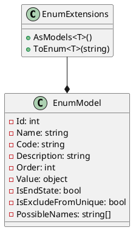
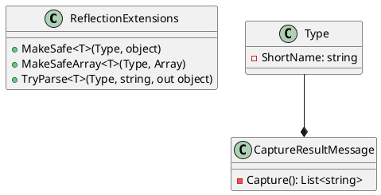
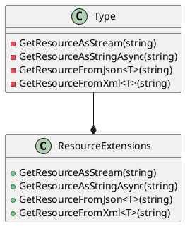

Here is the documentation for the source code files:

**EnumExtensionsTests.cs**

This class contains tests for the `EnumExtensions` class.

**Class Diagram:**

**Methods:**

* `AsModels<T>()`: Converts an enum to a list of `EnumModel` objects.
* `ToEnum<T>(string)`: Converts a string to an enum value of type `T`.

**Tests:**

* `AsModelsTest()`: Tests the `AsModels<T>()` method with the `AttributeTargets` enum.
* `AsModelsTest2()`: Tests the `AsModels<T>()` method with a custom enum.
* `ToEnumTest(string, TestEnum?)`: Tests the `ToEnum<T>(string)` method with various input strings.

**ReflectionExtensionsTests.cs**

This class contains tests for the `ReflectionExtensions` class.

**Class Diagram:**

**Methods:**

* `MakeSafe<T>(Type, object)`: Converts an object to a safe value of type `T`.
* `MakeSafeArray<T>(Type, Array)`: Converts an array to a safe array of type `T`.
* `TryParse<T>(Type, string, out object)`: Tries to parse a string to an object of type `T`.

**Tests:**

* `MakeSafeTest(Type, object, object)`: Tests the `MakeSafe<T>(Type, object)` method with various input types and objects.
* `MakeSafeArrayTest(Type, Array, Array)`: Tests the `MakeSafeArray<T>(Type, Array)` method with various input types and arrays.
* `TryParseTest(Type, string, bool, object)`: Tests the `TryParse<T>(Type, string, out object)` method with various input types and strings.

**ResourceExtensionsTests.cs**

This class contains tests for the `ResourceExtensions` class.

**Class Diagram:**

**Methods:**

* `GetResourceAsStream(string)`: Returns a stream for the specified resource.
* `GetResourceAsStringAsync(string)`: Returns the contents of the specified resource as a string.
* `GetResourceFromJson<T>(string)`: Deserializes the contents of the specified resource to an object of type `T`.
* `GetResourceFromXml<T>(string)`: Deserializes the contents of the specified resource to an object of type `T`.

**Tests:**

* `GetResourceAsStringAsyncTest()`: Tests the `GetResourceAsStringAsync(string)` method.
* `GetResourceStreamTest()`: Tests the `GetResourceAsStream(string)` method.
* `GetResourceStreamTest_ByType()`: Tests the `GetResourceAsStream(string)` method with a type parameter.
* `GetResourceStreamTest_NotFound()`: Tests the `GetResourceAsStream(string)` method with a non-existent resource.
* `GetResourceFromJsonAsyncTest()`: Tests the `GetResourceFromJson<T>(string)` method with a JSON file.
* `GetResourceFromJsonAsyncTest_NotFound()`: Tests the `GetResourceFromJson<T>(string)` method with a non-existent resource.
* `GetResourceFromXmlAsyncTest()`: Tests the `GetResourceFromXml<T>(string)` method with an XML file.
* `GetResourceFromJsonTest()`: Tests the `GetResourceFromJson<T>(string)` method with a JSON file.
* `GetResourceFromJsonTest_NotFound()`: Tests the `GetResourceFromJson<T>(string)` method with a non-existent resource.
* `GetResourceFromXmlTest()`: Tests the `GetResourceFromXml<T>(string)` method with an XML file.

Note: The class diagrams are generated using Plant