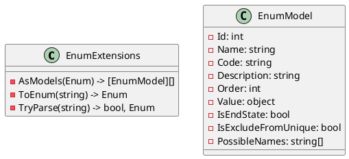
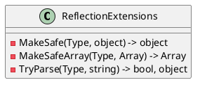

Here is the documentation for the source code in Markdown format:

**EnumExtensionsTests.cs**
=====================

This test class contains tests for the `EnumExtensions` class, which provides extensions for working with enums.

### TestCases
------------

* `AsModelsTest`: Tests the `AsModels` method, which converts an enum to an array of `EnumModel` objects.
* `AsModelsTest2`: Tests the `AsModels` method with a custom enum.
* `ToEnumTest`: Tests the `ToEnum` method, which converts a string to an enum value.
* `TryParseTest`: Tests the `TryParse` method, which attempts to parse a string to an enum value.

### Class Diagram
----------------



### Component Model
-------------------

```plantuml
@startuml
!include https://raw.githubusercontent.com/plantuml-stdlib/C4-plantUML/master/C4_Container.puml

Container "System" {
  Container "EnumExtensions" {
    Artifact "AsModels"
    Artifact "ToEnum"
    Artifact "TryParse"
  }
}

Container "EnumModel" {
  Artifact "Id"
  Artifact "Name"
  Artifact "Code"
  Artifact "Description"
  Artifact "Order"
  Artifact "Value"
  Artifact "IsEndState"
  Artifact "IsExcludeFromUnique"
  Artifact "PossibleNames"
}
@enduml
```

**ReflectionExtensionsTests.cs**
=============================

This test class contains tests for the `ReflectionExtensions` class, which provides extensions for working with .NET types.

### TestCases
------------

* `MakeSafeTest`: Tests the `MakeSafe` method, which converts a type and its value to a safe type.
* `MakeSafeArrayTest`: Tests the `MakeSafeArray` method, which converts an array to a safe array.
* `TryParseTest`: Tests the `TryParse` method, which attempts to parse a value to a type.

### Class Diagram
----------------



### Component Model
-------------------

```plantuml
@startuml
!include https://raw.githubusercontent.com/plantuml-stdlib/C4-plantUML/master/C4_Container.puml

Container "System" {
  Container "ReflectionExtensions" {
    Artifact "MakeSafe"
    Artifact "MakeSafeArray"
    Artifact "TryParse"
  }
}
@enduml
```

**ResourceExtensionsTests.cs**
=============================

This test class contains tests for the `ResourceExtensions` class, which provides extensions for working with resources.

### TestCases
------------

* `GetResourceAsStringAsyncTest`: Tests the `GetResourceAsStringAsync` method, which reads a resource as a string.
* `GetResourceStreamTest`: Tests the `GetResourceStream` method, which reads a resource as a stream.
* `GetResourceStreamTest_ByType`: Tests the `GetResourceStream` method with a type parameter.
* `GetResourceStreamTest_NotFound`: Tests the `GetResourceStream` method with a non-existent resource.
* `GetResourceFromJsonAsyncTest`: Tests the `GetResourceFromJsonAsync` method, which reads a JSON resource asynchronously.
* `GetResourceFromJsonAsyncTest_NotFound`: Tests the `GetResourceFromJsonAsync` method with a non-existent resource.
* `GetResourceFromXmlAsyncTest`: Tests the `GetResourceFromXmlAsync` method, which reads an XML resource asynchronously.
* `GetResourceFromJsonTest`: Tests the `GetResourceFromJson` method, which reads a JSON resource synchronously.
* `GetResourceFromJsonTest_NotFound`: Tests the `GetResourceFromJson` method with a non-existent resource.
* `GetResourceFromXmlTest`: Tests the `GetResourceFromXml` method, which reads an XML resource synchronously.

### Class Diagram
----------------

```plantuml
@startuml
class ResourceExtensions {
  - GetResourceAsString(string) -> string
  - GetResourceStream(string) -> Stream
  - GetResourceFromJsonAsync(string) -> JsonConvert
  - GetResourceFromJson(string) -> JsonConvert
  - GetResourceFromXmlAsync(string) -> XmlSerialize
  - GetResourceFromXml(string) -> XmlSerialize