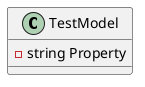

Here is the documentation for the `TestModel.cs` file, including a class diagram in PlantUML:

**Class Documentation**

### TestModel

The `TestModel` class is a simple test model used to demonstrate reflection functionality.

**Namespace:** Eliassen.System.Tests.Reflection.TestTargets

**Class Description:**

This class represents a basic test model with a single required property named `Property`.

**Class Diagram**



### Class Members

#### Property

| Member Type | Name | Description |
| --- | --- | --- |
| Public | Property | A required string property |

### Notes

The `TestModel` class is designed to be a simple test model for reflection testing purposes. The `Property` property is required and can only be of type `string`.

**Source Code**

```csharp
namespace Eliassen.System.Tests.Reflection.TestTargets;

public class TestModel
{
    public required string Property { get; set; }
}
```

This documentation provides a clear and concise overview of the `TestModel` class, including its namespace, description, class diagram, and member details. The PlantUML class diagram provides a visual representation of the class's structure and relationships.