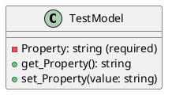
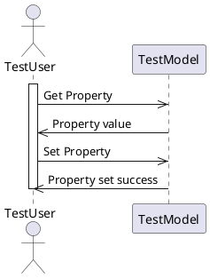

**Documentation for TestModel.cs**

**Overview**

The `TestModel` class is a simple example of a .NET class used for testing reflection capabilities in the Eliassen.System.Tests.Reflection namespace.

**Class Diagram**

**Class Description**

The `TestModel` class has a single property `Property` which is a required string. The class also has getter and setter methods for the property.

**Properties**

* `Property`: A required string property with getter and setter methods.

**Sequence Diagram**

**Sequence Diagram Description**

The sequence diagram shows a simple interaction between a `TestUser` and a `TestModel` instance. The `TestUser` first requests the value of the `Property` using the getter method. The `TestModel` instance then returns the property value to the `TestUser`. Next, the `TestUser` sets a new value for the `Property` using the setter method. Finally, the `TestModel` instance confirms the successful property value update.

**Conclusion**

The `TestModel` class is a simple example of a .NET class used for testing reflection capabilities. It has a single required string property with getter and setter methods, and can be used as a target for testing reflection operations.