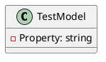

**README**

**Summary**

The Eliassen.System.Tests.Reflection.TestTargets namespace contains a set of test files for testing reflection functionality in .NET. The TestModel.cs file defines a simple class with a required string property. The files in this namespace can be used to verify the accuracy and correctness of reflection operations in the .NET framework.

**Technical Summary**

The TestModel class is an example of a simple .NET class that can be used to test reflection operations. The required keyword is used to indicate that the Property field cannot be null. The class follows the standard properties pattern, where the Property getter and setter are defined.

**Component Diagram**

This component diagram shows the TestModel class with its Property property. The Property represents the required string field of the TestModel class. This diagram provides a high-level view of the components and their relationships.

Note: This is a simple UML diagram that only shows the TestModel class and its Property. You can add more classes and relationships to this diagram as needed.