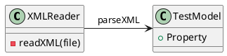

**README**

This repository contains a set of source files that demonstrate a simple resource management system. The system is designed to read and parse XML files containing test data.

**Summary**

The system consists of a single XML file, `SampleResource.xml`, which contains a simple test model with a single property. The system reads this file and extracts the property value, which is then displayed to the user.

**Technical Summary**

The system uses a simple Domain-Driven Design (DDD) approach, with a single domain model (`TestModel`) that represents the business logic. The model is defined in the XML file using a simple property declaration.

The system also employs a Factory pattern to create instances of the domain model from the XML file. This allows for decoupling of the domain logic from the actual implementation of the data reading and parsing.

**Component Diagram**

Here is a component diagram illustrating the architecture of the system:

In this diagram, the `XMLReader` component reads the XML file and parses it into a `TestModel` instance. The `TestModel` component represents the domain model, with a single property.

Note: The PlantUML syntax used here is a simplified version of the full syntax supported by PlantUML.