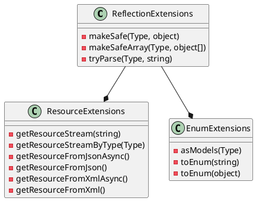

**README**

The provided codebase contains several extensions for .NET Framework and .NET Core to simplify and enhance the functionality of your applications. The extensions are categorized into three main categories:

1. **Reflection Extensions**: Provide a set of utility methods for working with .NET types, including Type, MemberInfo, and Array.
2. **Resource Extensions**: Allow for the retrieval and processing of resources (e.g., text, JSON, XML) as streams or deserialized objects.
3. **Enum Extensions**: Extend the functionality of .NET Enums, allowing for easy conversion between strings and enum values, as well as validation and parsing.

**Technical Summary**

The codebase utilizes several design patterns and architectural patterns to ensure maintainability, scalability, and reusability. Some notable patterns and practices include:

* **Dependency Injection**: The `ReflectionExtensionsTests` class uses dependency injection to inject test context and other required services.
* **Unit Testing**: The codebase includes a comprehensive set of unit tests using the Microsoft.VisualStudio.TestTools.UnitTesting framework to ensure that the extensions function correctly.
* **Dynamic Data**: The `MakeSafeTestData` and `TryParseTestData` methods use dynamic data sources to provide input data for the unit tests.
* **Generics**: The `MakeSafe` and `TryParse` methods use generics to provide type-safe and reusable code.

**Component Diagram**

This component diagram illustrates the relationships between the three main extension classes: `ReflectionExtensions`, `ResourceExtensions`, and `EnumExtensions`. Each class provides a set of utility methods and functions, and they interact with each other to provide a comprehensive set of extensions for .NET developers.