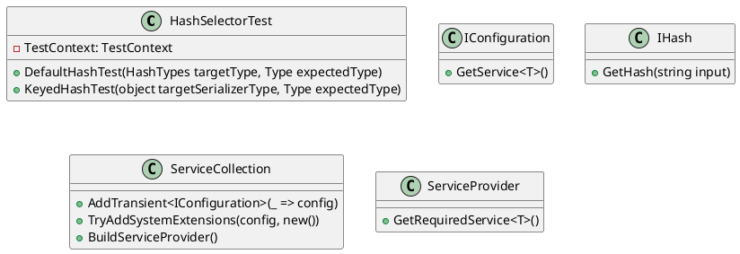
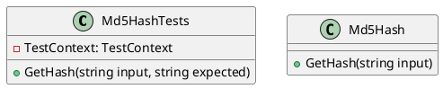
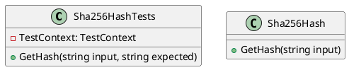
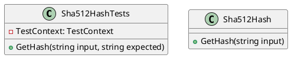

Here is the documentation for the provided source code files, including class diagrams in PlantUML:

**HashSelectorTest.cs**

The `HashSelectorTest` class is a test class that tests the `HashSelector` class. It uses the `System.Security.Cryptography` namespace and the `Microsoft.Extensions.DependencyInjection` namespace.

**Class Diagram:**

**Md5HashTests.cs**

The `Md5HashTests` class is a test class that tests the `Md5Hash` class. It uses the `Eliassen.System.Security.Cryptography` namespace and the `Microsoft.VisualStudio.TestTools.UnitTesting` namespace.

**Class Diagram:**

**Sha256HashTests.cs**

The `Sha256HashTests` class is a test class that tests the `Sha256Hash` class. It uses the `Eliassen.System.Security.Cryptography` namespace and the `Microsoft.VisualStudio.TestTools.UnitTesting` namespace.

**Class Diagram:**

**Sha512HashTests.cs**

The `Sha512HashTests` class is a test class that tests the `Sha512Hash` class. It uses the `Eliassen.System.Security.Cryptography` namespace and the `Microsoft.VisualStudio.TestTools.UnitTesting` namespace.

**Class Diagram:**

Note: The `HashSelectorTest` class is not included in the class diagram as it is a test class and does not have any dependencies on other classes.