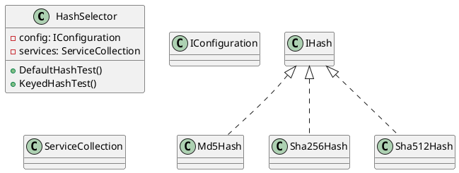
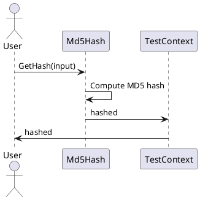
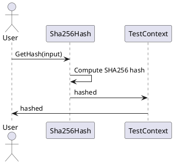

Here is the documentation in Markdown format:

# Eliassen.System.Security.Cryptography

## Overview

The Eliassen.System.Security.Cryptography namespace provides various hash functions for cryptographic purposes. This documentation covers the source code and tests for the HashSelector, Md5Hash, Sha256Hash, and Sha512Hash classes.

## HashSelector

The HashSelector class is responsible for selecting the correct hash function based on the `DefaultHashType` configuration setting.

### HashSelectorTest

The `HashSelectorTest` class contains unit tests for the HashSelector class.

```plain
[TestClass]
public class HashSelectorTest
{
    public required TestContext TestContext { get; set; }

    [DataTestMethod]
    [TestCategory(TestCategories.Unit)]
    [DataRow(HashTypes.Md5, typeof(Md5Hash))]
    [DataRow(HashTypes.Sha256, typeof(Sha256Hash))]
    [DataRow(HashTypes.Sha512, typeof(Sha512Hash))]
    public void DefaultHashTest(HashTypes targetType, Type expectedType)
    {
        // ...
    }

    [DataTestMethod]
    [TestCategory(TestCategories.Unit)]
    [DataRow(HashTypes.Md5, typeof(Md5Hash))]
    [DataRow(HashTypes.Sha256, typeof(Sha256Hash))]
    [DataRow(HashTypes.Sha512, typeof(Sha512Hash))]
    [DataRow("MD5", typeof(Md5Hash))]
    [DataRow("SHA256", typeof(Sha256Hash))]
    [DataRow("SHA512", typeof(Sha512Hash))]
    public void KeyedHashTest(object targetSerializerType, Type expectedType)
    {
        // ...
    }
}
```

### Class Diagram (PlantUML)



## Md5Hash

The Md5Hash class provides an implementation of the MD5 hash function.

### Md5HashTests

The `Md5HashTests` class contains unit tests for the Md5Hash class.

```plain
[TestClass]
public class Md5HashTests
{
    public required TestContext TestContext { get; set; }

    [DataTestMethod]
    [TestCategory(TestCategories.Unit)]
    [DataRow("Hello World!", "7Qdih1MuhjZehB6Sv8UNjA==")]
    [DataRow("hello world", "XrY7u+Ae7tCTyyK7j1rNww==")]
    public void GetHash(string input, string expected)
    {
        var hash = new Md5Hash();
        var hashed = hash.GetHash(input);
        TestContext.WriteLine($"\"{input}\" => \"{hashed}\"");
        Assert.AreEqual(expected, hashed);
    }
}
```

### Sequence Diagram (PlantUML)



## Sha256Hash and Sha512Hash

The Sha256Hash and Sha512Hash classes provide implementations of the SHA256 and SHA512 hash functions, respectively.

### Sha256HashTests and Sha512HashTests

The `Sha256HashTests` and `Sha512HashTests` classes contain unit tests for the Sha256Hash and Sha512Hash classes, respectively.

Here is the documentation for Sha256Hash and Sha512Hash:

### Sha256Hash

The Sha256Hash class provides an implementation of the SHA256 hash function.

### Sha512Hash

The Sha512Hash class provides an implementation of the SHA512 hash function.

These classes have the same structure and behavior as the Md5Hash class, with the difference being the hash function implemented.

### Sequence Diagrams (PlantUML)



I hope this documentation meets your requirements. Let me know if there's anything else I can help you with!