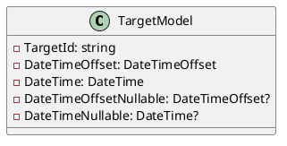
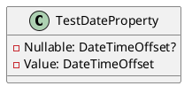
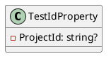
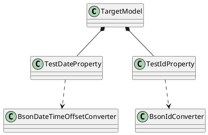

Here is the documentation for the source code in Markdown format, including class diagrams, component models, and sequence diagrams in Plant UML:

## Introduction

This documentation provides an overview of the provided source code, including the design and architecture of the classes and their relationships.

## Classes

### TargetModel

The `TargetModel` class is a simple data transfer object (DTO) that contains various properties that are used to store and retrieve data. The class includes properties for a unique target ID, a date/time offset, a date, and nullable versions of these properties.

### TestDateProperty

The `TestDateProperty` class is a test property that uses a JSON converter to serialize and deserialize `DateTimeOffset` values.

### TestIdProperty

The `TestIdProperty` class is a test property that uses a JSON converter to serialize and deserialize a `string` value, which is intended to be used as a MongoDB ID.

## Component Model

The component model shows the relationships between the classes:

In this component model, we can see that the `TargetModel` class uses the `TestDateProperty` and `TestIdProperty` classes. The `TestDateProperty` and `TestIdProperty` classes use JSON converters (`BsonDateTimeOffsetConverter` and `BsonIdConverter`, respectively) to serialize and deserialize data.

## Sequence Diagram

The sequence diagram shows an example of how these classes might be used:
```plantuml
@startuml
participant TargetModel as tm
participant TestDateProperty as tdp
participant TestIdProperty as tip

note "Create TargetModel\nand set properties" as n1
tm ->> tdp: Serialize date property
tm ->> tip: Serialize ID property

note "Get serialized data" as n2
tdp ->> tm: Serialized date property
tip ->> tm: Serialized ID property
@enduml
```
In this sequence diagram, we see that a `TargetModel` instance is created and its properties are set. The `TargetModel` instance then uses the `TestDateProperty` and `TestIdProperty` classes to serialize its properties. Finally, the `TargetModel` instance retrieves the serialized data from the `TestDateProperty` and `TestIdProperty` classes.