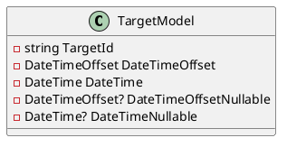
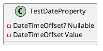
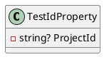

Here is the documentation for the provided source code files, including class diagrams in PlantUML:

**TargetModel.cs**

**Class Diagram:**

**Class Description:**

The `TargetModel` class is used to represent a target model for testing purposes. It contains properties for a target ID, a date time offset, a date time, a nullable date time offset, and a nullable date time. These properties can be used to test various scenarios related to date and time data types.

**Properties:**

* `TargetId`: A string property representing the target ID of the model. It is initialized with a random GUID string.
* `DateOffset`: A date time offset property representing the date time offset of the model. It is initialized with the current date time.
* `DateTime`: A date time property representing the date time of the model. It is initialized with the current date time.
* `DateOffsetNullable`: A nullable date time offset property representing the date time offset of the model. It is initialized with the current date time.
* `DateTimeNullable`: A nullable date time property representing the date time of the model. It is initialized with the current date time.

**TestDateProperty.cs**

**Class Diagram:**

**Class Description:**

The `TestDateProperty` class is used to test date properties with JSON serialization and deserialization. It contains two properties: `Nullable` and `Value`, both of which are of type `DateTimeOffset`.

**Properties:**

* `Nullable`: A nullable date time offset property that can be serialized and deserialized with JSON.
* `Value`: A date time offset property that can be serialized and deserialized with JSON.

**Attributes:**

The class uses two attributes:

* `[JsonConverter(typeof(BsonDateTimeOffsetConverter))]`: Indicates that the `Nullable` and `Value` properties should be converted to and from BSON date time offsets using the `BsonDateTimeOffsetConverter` converter.
* `[JsonConverter(typeof(BsonDateTimeOffsetConverter))]`: Indicates that the `Nullable` and `Value` properties should be converted to and from BSON date time offsets using the `BsonDateTimeOffsetConverter` converter.

**TestIdProperty.cs**

**Class Diagram:**

**Class Description:**

The `TestIdProperty` class is used to test ID properties with JSON serialization and deserialization. It contains a single property: `ProjectId`, which is of type `string`.

**Properties:**

* `ProjectId`: A nullable string property that can be serialized and deserialized with JSON.

**Attributes:**

The class uses two attributes:

* `[JsonPropertyName("_id")]`: Indicates that the `ProjectId` property should be serialized and deserialized with the name "_id" instead of "ProjectId".
* `[JsonConverter(typeof(BsonIdConverter))]`: Indicates that the `ProjectId` property should be converted to and from BSON ID using the `BsonIdConverter` converter.