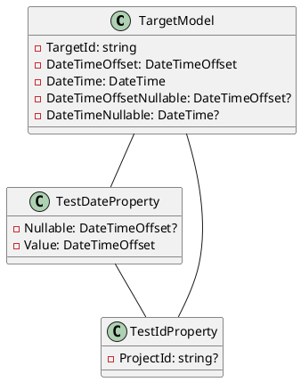

**README**

This repository contains source files for test models and properties that demonstrate the functionality of converting and serializing date and time related properties in .NET.

**Summary**

The files contained in this repository include:

* `TargetModel.cs`: A test model that represents a target object with various date and time properties, including nullable and non-nullable types.
* `TestDateProperty.cs`: A test property that demonstrates the conversion of `DateTimeOffset` and `DateTime` properties to/from JSON.
* `TestIdProperty.cs`: A test property that demonstrates the conversion of a `string` property as a MongoDB `_id` property to/from JSON.

**Technical Summary**

The design pattern used in this repository is the [Repository Pattern](https://en.wikipedia.org/wiki/Repository_pattern), which is an architectural pattern that abstracts the data access logic from the business logic of an application.

The `TargetModel` class represents a repository of date and time properties, which are used to demonstrate the functionality of converting and serializing these properties.

The `TestDateProperty` class uses the [JsonConverter attribute](https://docs.microsoft.com/en-us/dotnet/api/system.text.json.serialization.jsonconverterattribute?view=netcore-3.1) to specify the converter for `DateTimeOffset` and `DateTime` properties, which allows for the serialization of these properties to/from JSON.

The `TestIdProperty` class uses the [JsonPropertyName attribute](https://docs.microsoft.com/en-us/dotnet/api/system.text.json.serialization.jsonpropnameattribute?view=netcore-3.1) to specify the JSON property name for the `ProjectId` property, which allows for the serialization of this property to/from JSON.

**Component Diagram**

This component diagram shows the relationships between the `TargetModel`, `TestDateProperty`, and `TestIdProperty` classes. The `TargetModel` class has relationships with both `TestDateProperty` and `TestIdProperty`, indicating that they are part of the same system.