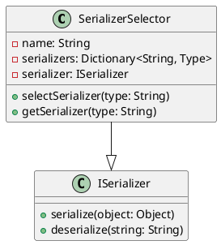

Here is the documentation for the source code in Markdown format, with class diagrams, component models, and sequence diagrams in PlantUML:

**SerializerSelectorTest.cs**

### Introduction

This is a unit test for the `SerializerSelector` class in Eliassen.System.Text. The class is responsible for selecting a serializer to use for serialization and deserialization operations.

### Class Diagram



### Component Model

```plantuml
@startuml
component SerializerSelectorTest {
  heart SerializerSelector
  heart ISerializer
  use ConfigurationBuilder
  use ServiceCollection
  use IComparer<String>
  use Dictionary<String, Type>
}

 SerializerSelectorTest --|> SerializerSelector
SerializerSelectorTest --|> ISerializer
@enduml
```

### Sequence Diagram

```plantuml
@startuml
sequenceDiagram
 participant SerializerSelectorTest as ts
 participant ConfigurationBuilder as cb
 participant ServiceCollection as sc
 participant IComparer as ic
 participant Dictionary as dic

 ts->>cb: Create configuration builder
 cb->>sc: Add transient configuration
 sc->>ts: Build service provider
 ts->>sc: Get required service
 sc->>ts: Get serializer
 ts->>sc: Get keyed service
 sc->>ts: Get serializer by key
@enduml
```

### Code Description

The `SerializerSelectorTest` class contains two test methods: `DefaultSerializerTest` and `KeyedSerializerTest`. These tests verify that the `SerializerSelector` class correctly selects a serializer based on its type (e.g., JSON, BSON, XML) and a custom key.

In `DefaultSerializerTest`, the test sets up a configuration and a service provider, and then uses the `TryAddSystemExtensions` method to add serializer extensions to the provider. It then gets an instance of the `ISerializer` interface from the provider and verifies that it is of the expected type based on the default serializer type.

In `KeyedSerializerTest`, the test sets up a configuration and a service provider, and then uses the `TryAddSystemExtensions` method to add serializer extensions to the provider. It then gets an instance of the `ISerializer` interface from the provider using the `GetRequiredKeyedService` method and verifies that it is of the expected type based on the custom key.

### Notes

The `SerializerSelector` class uses a dictionary to store serializer types, where the key is a string (e.g., "JSON") and the value is a type (e.g., `DefaultJsonSerializer`). The class uses this dictionary to select a serializer based on the provided type or key. The `ISerializer` interface defines methods for serialization and deserialization operations.