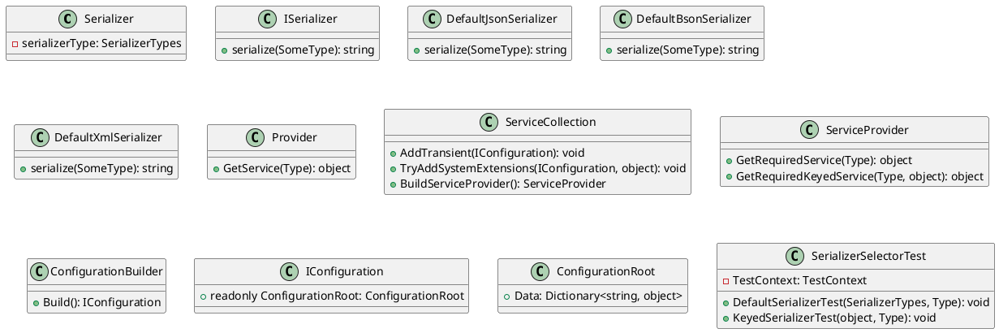

Here is the documentation for the provided source code files:

**SerializerSelectorTest.cs**

This file contains a unit test class called `SerializerSelectorTest` that tests the `SerializerSelector` class.

**Class Diagram:**

Here is the class diagram for the `SerializerSelectorTest` class using PlantUML:

**Description:**

The `SerializerSelectorTest` class contains two test methods: `DefaultSerializerTest` and `KeyedSerializerTest`. These tests verify that the `SerializerSelector` class can correctly select the appropriate serializer based on the `SerializerTypes` enum and a string key.

In the `DefaultSerializerTest`, the test method tests that the serializer is correctly selected when a `SerializerTypes` enum value is provided. In the `KeyedSerializerTest`, the test method tests that the serializer is correctly selected when a string key is provided.

The tests use the `Microsoft.Extensions.DependencyInjection` namespace to create a service collection and build a provider. They then use the provider to resolve an instance of the `ISerializer` interface, which is implemented by the `DefaultJsonSerializer`, `DefaultBsonSerializer`, and `DefaultXmlSerializer` classes.

**Note:** The `SerializerTypes` enum and the `ISerializer` interface are not shown in the class diagram, as they are not part of the provided source code.