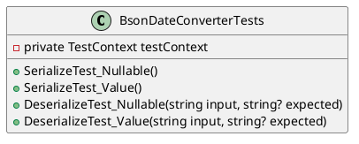
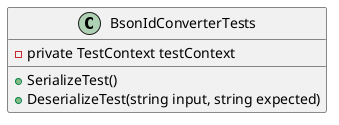
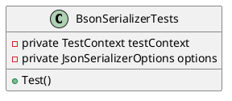
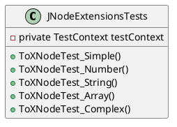

Here is the documentation for the provided source code files:

**BsonDateConverterTests.cs**

This is a unit test class for the `BsonDateConverter` class, which is responsible for serializing and deserializing `DateTimeOffset` values to and from JSON.

Class Diagram:

Methods:

* `SerializeTest_Nullable()`: Tests the serialization of a nullable `DateTimeOffset` value to JSON.
* `SerializeTest_Value()`: Tests the serialization of a non-nullable `DateTimeOffset` value to JSON.
* `DeserializeTest_Nullable(string input, string? expected)`: Tests the deserialization of a nullable `DateTimeOffset` value from JSON.
* `DeserializeTest_Value(string input, string? expected)`: Tests the deserialization of a non-nullable `DateTimeOffset` value from JSON.

**BsonIdConverterTests.cs**

This is a unit test class for the `BsonIdConverter` class, which is responsible for serializing and deserializing `string` values to and from JSON.

Class Diagram:

Methods:

* `SerializeTest()`: Tests the serialization of a `string` value to JSON.
* `DeserializeTest(string input, string expected)`: Tests the deserialization of a `string` value from JSON.

**BsonSerializerTests.cs**

This is a unit test class for the `BsonSerializer` class, which is responsible for serializing and deserializing objects to and from JSON.

Class Diagram:

Methods:

* `Test()`: Tests the serialization and deserialization of an object using the `BsonSerializer`.

**JNodeExtensionsTests.cs**

This is a unit test class for the `JNodeExtensions` class, which provides methods for converting `JsonNode` objects to and from other formats.

Class Diagram:

Methods:

* `ToXNodeTest_Simple()`: Tests the conversion of a simple JSON object to XML.
* `ToXNodeTest_Number()`: Tests the conversion of a number JSON value to XML.
* `ToXNodeTest_String()`: Tests the conversion of a string JSON value to XML.
* `ToXNodeTest_Array()`: Tests the conversion of an array JSON value to XML.
* `ToXNodeTest_Complex()`: Tests the conversion of a complex JSON object to XML.