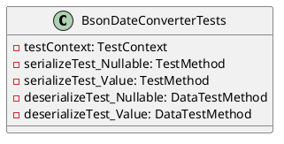
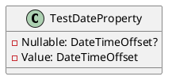
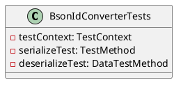
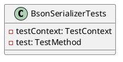

# Eliassen.System.Text.Json Tests

This document provides an overview of the tests for the Eliassen.System.Text.Json library.

## BsonDateConverterTests

This test class covers the serialization and deserialization of dates using the BsonDateConverter.

### Serialize Tests

* `SerializeTest_Nullable`: Tests the serialization of a nullable date property.
* `SerializeTest_Value`: Tests the serialization of a non-nullable date property.

### Deserialize Tests

* `DeserializeTest_Nullable`: Tests the deserialization of a nullable date property.
* `DeserializeTest_Value`: Tests the deserialization of a non-nullable date property.





### Sequence Diagram

```plantuml
@startuml
actor Tester
participant "Eliassen.System.Text.Json" as Json
participant "System.Text.Json" as JsonSerializer
participant "BsonDateConverter" as Converter
sequenceDiagram
  note left: SerializeTest_Nullable
  Tester..>Json: Serialize
  Json..>JsonSerializer: Serialize
  JsonSerializer..>Converter: Serialize
  Converter..>Json: Serialize
  note right: Serailize
  alt deserialize
    note left: DeserializeTest_Nullable
    Tester..>Json: Deserialize
    Json..>JsonSerializer: Deserialize
    JsonSerializer..>Converter: Deserialize
    Converter..>Json: Deserialize
  end
@enduml
```

## BsonIdConverterTests

This test class covers the serialization and deserialization of IDs using the BsonIdConverter.

### Serialize Test

* `SerializeTest`: Tests the serialization of an ID property.

### Deserialize Tests

* `DeserializeTest`: Tests the deserialization of an ID property.



```plantuml
class TestIdProperty {
  - ProjectId: string
}
@enduml
```

### Sequence Diagram

```plantuml
@startuml
actor Tester
participant "Eliassen.System.Text.Json" as Json
participant "System.Text.Json" as JsonSerializer
participant "BsonIdConverter" as Converter
sequenceDiagram
  note left: SerializeTest
  Tester..>Json: Serialize
  Json..>JsonSerializer: Serialize
  JsonSerializer..>Converter: Serialize
  Converter..>Json: Serialize
  note right: Serialize
  alt deserialize
    note left: DeserializeTest
    Tester..>Json: Deserialize
    Json..>JsonSerializer: Deserialize
    JsonSerializer..>Converter: Deserialize
    Converter..>Json: Deserialize
  end
@enduml
```

## BsonSerializerTests

This test class covers the serialization of a target model using the BsonSerializer.

### Test

* `Test`: Tests the serialization of a target model.



```plantuml
class TargetModel {
  - // properties
}
@enduml
```

### Sequence Diagram

```plantuml
@startuml
actor Tester
participant "Eliassen.System.Text.Json" as Json
participant "System.Text.Json" as JsonSerializer
sequenceDiagram
  note left: Test
  Tester..>Json: Serialize
  Json..>JsonSerializer: Serialize
  JsonSerializer..>Json: Serialize
  note right: Serialize
@enduml
```

## JNodeExtensionsTests

This test class covers the `ToXFragment` method of the `JNodeExtensions` class.

### ToXNode Tests

* `ToXNodeTest_Simple`: Tests the serialization of a simple JSON node.
* `ToXNodeTest_Number`: Tests the serialization of a number JSON node.
* `ToXNodeTest_String`: Tests the serialization of a string JSON node.
* `ToXNodeTest_Array`: Tests the serialization of an array JSON node.
* `ToXNodeTest_Complex`: Tests the serialization of a complex JSON node.

```plantuml
@startuml
class JNodeExtensionsTests {
  - testContext: TestContext
  - toXNodeTest_Simple: TestMethod
  - toXNodeTest_Number: TestMethod
  - toXNodeTest_String: TestMethod
  - toXNodeTest_Array: TestMethod
  - toXNodeTest_Complex: TestMethod
}
@enduml