# Eliassen.System.Text.Json.Serialization: DefaultJsonSerializerTests

This is a test class for the `DefaultJsonSerializer` class, which is part of the Eliassen.System.Text.Json.Serialization namespace. The `DefaultJsonSerializer` class is responsible for serializing and deserializing objects to and from JSON.

## Overview

The `DefaultJsonSerializerTests` class contains three test methods that test the serialization and deserialization capabilities of the `DefaultJsonSerializer` class.

### SerializeTest_Anonymous

This test method tests the serialization of an anonymous object to JSON. It creates an anonymous object with a single property, `Hello`, and serializes it using the `DefaultJsonSerializer`. The serialized JSON is then deserialized back into an object, and the test checks that the original object is equal to the deserialized object.

### SerializeTest_AnonymousWithStringObjectDictionary

This test method tests the serialization of an anonymous object that contains a dictionary of strings to objects. The dictionary contains three key-value pairs, with the values being integers, longs, and strings. The test serializes the object using the `DefaultJsonSerializer` and then deserializes the JSON back into an object. The test checks that the original object's properties and the deserialized object's properties are equal.

### SerializeTest_IConfigurationSection

This test method tests the serialization of an `IConfigurationSection` object to JSON. It creates a `ConfigurationBuilder` object and adds a configuration section with a single property. The test serializes the configuration section using the `DefaultJsonSerializer` and then deserializes the JSON back into an object. The test checks that the original property value is equal to the deserialized property value.

### InOut Method

The `InOut` method is a helper method used by the test methods to serialize and deserialize objects. It takes an object and a serializer as input, serializes the object to JSON, and then deserializes the JSON back into an object. The method returns a tuple containing the serialized JSON and the deserialized object.

## Class Diagram (PlantUML)

```plantuml
@startuml
class DefaultJsonSerializer {
  - serialize(object: T): string
  - deserialize(string: json): T
}

class TestContext {
  - AddResult(string: result)
}

class DefaultJsonSerializerTests {
  - SerializeTest_Anonymous()
  - SerializeTest_AnonymousWithStringObjectDictionary()
  - SerializeTest_IConfigurationSection()
}

class IConfigurationSection
  - [Property]: string

class AnonymousObject {
  - Hello: string
  - Dict: Dictionary<string, object>
}

class StringObjectDictionary {
  - one: 1L
  - two: 2L
  - three: "3"
}

@enduml
```

## Component Model (PlantUML)

```plantuml
@startuml
component DefaultJsonSerializer {
  component serialize
  component deserialize
}

component TestContext {
  component AddResult
}

component DefaultJsonSerializerTests {
  component SerializeTest_Anonymous
  component SerializeTest_AnonymousWithStringObjectDictionary
  component SerializeTest_IConfigurationSection
}

component IConfigurationSection {
  component Property
}

component AnonymousObject {
  component Hello
  component Dict
}

component StringObjectDictionary {
  component one
  component two
  component three
}

DefaultJsonSerializer -> serialize
DefaultJsonSerializer -> deserialize
TestContext -> AddResult
DefaultJsonSerializerTests -> SerializeTest_Anonymous
DefaultJsonSerializerTests -> SerializeTest_AnonymousWithStringObjectDictionary
DefaultJsonSerializerTests -> SerializeTest_IConfigurationSection
IConfigurationSection -> Property
AnonymousObject -> Hello
AnonymousObject -> Dict
StringObjectDictionary -> one
StringObjectDictionary -> two
StringObjectDictionary -> three

@enduml
```



## Sequence Diagram (PlantUML)

```plantuml
@startuml
sequenceDiagram
participant DefaultJsonSerializer as "DJS"
participant TestContext as "TC"
participant DefaultJsonSerializerTests as "DJS Tests"
participant AnonymousObject as "AO"
participant StringObjectDictionary as "SOD"
participant IConfigurationSection as "ICS"

DJS ->> AO: Serialize
DJS ->> TC: AddResult
note over DJS, AO: Serialize anonymous object
note over TC: Add result to test context

DJS ->> SOD: Serialize
DJS ->> TC: AddResult
note over DJS, SOD: Serialize string-object dictionary
note over TC: Add result to test context

DJS ->> ICS: Serialize
DJS ->> TC: AddResult
note over DJS, ICS: Serialize configuration section
note over TC: Add result to test context

DJS Tests ->> DJS: Serialize
DJS Tests ->> DJS: Deserialize
note over DJS Tests, DJS: Serialize and deserialize
@enduml
```

I hope this documentation helps! Let me know if you have any further questions.