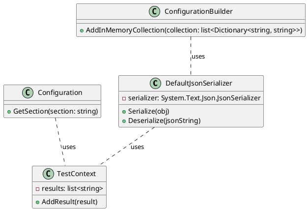

**README**

**Summary**

The `DefaultJsonSerializerTests` project contains a set of unit tests for the `DefaultJsonSerializer` class, a JSON serialization and deserialization library. The tests cover various scenarios, including anonymous objects, objects with dictionaries, and `IConfigurationSection` objects. The library uses the `System.Text.Json` namespace to serialize and deserialize JSON data.

**Technical Summary**

The `DefaultJsonSerializer` class uses the Adapter Design Pattern to adapt the `System.Text.Json` library to the needs of the `DefaultJsonSerializer` class. The class also uses the Strategy Design Pattern to define different serialization and deserialization strategies for different types of objects.

The `DefaultJsonSerializer` class is designed to be flexible and extensible, allowing users to customize the serialization and deserialization process by implementing custom serialization and deserialization strategies.

**Component Diagram**

This component diagram shows the main components of the `DefaultJsonSerializer` class, including the `System.Text.Json.JsonSerializer` object, the `TestContext` class, and the `ConfigurationBuilder` and `Configuration` classes. The diagram also shows the relationships between these components, including the use of the `ConfigurationBuilder` class by the `DefaultJsonSerializer` class and the use of the `TestContext` class by the `DefaultJsonSerializer` class.