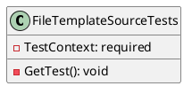
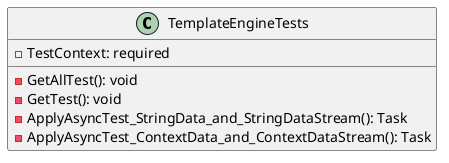
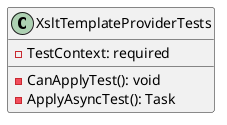

Here is the documentation for the provided source code files, including class diagrams in PlantUML:

**FileTemplateSourceTests.cs**

```csharp
[TestClass]
public class FileTemplateSourceTests
{
    // ...

    [TestMethod]
    [TestCategory(TestCategories.Unit)]
    public void GetTest()
    {
        // ...
    }
}
```

Class Diagram:


**TemplateEngineTests.cs**

```csharp
[TestClass]
public class TemplateEngineTests
{
    // ...

    [TestMethod]
    [TestCategory(TestCategories.Unit)]
    public void GetAllTest()
    {
        // ...
    }

    [TestMethod]
    [TestCategory(TestCategories.Unit)]
    public void GetTest()
    {
        // ...
    }

    [TestMethod]
    [TestCategory(TestCategories.Unit)]
    public async Task ApplyAsyncTest_StringData_and_StringDataStream()
    {
        // ...
    }

    [TestMethod]
    [TestCategory(TestCategories.Unit)]
    public async Task ApplyAsyncTest_ContextData_and_ContextDataStream()
    {
        // ...
    }
}
```

Class Diagram:


**XsltTemplateProviderTests.cs**

```csharp
[TestClass]
public class XsltTemplateProviderTests
{
    // ...

    [TestMethod]
    [TestCategory(TestCategories.Unit)]
    public void CanApplyTest()
    {
        // ...
    }

    [TestMethod]
    [TestCategory(TestCategories.Unit)]
    public async Task ApplyAsyncTest()
    {
        // ...
    }
}
```

Class Diagram:


Note: The above class diagrams are simplified and do not show all the methods and properties in the classes. They are intended to provide a high-level overview of the classes and their relationships.