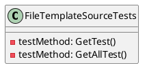
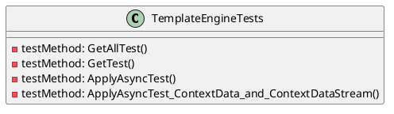
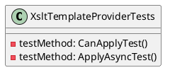

Here is the markdown documentation for the source code:

**Eliassen.System.Text.Templating**

Eliassen.System.Text.Templating is a .NET library that provides functionality for text templating and XML to HTML transformation.

**Classes**

### FileTemplateSourceTests

```FileTemplateSourceTests.cs```

This class contains unit tests for the `FileTemplateSource` class.



### FileTemplateSource

The `FileTemplateSource` class is responsible for retrieving file templates from a file system.

### TemplateEngineTests

```TemplateEngineTests.cs```

This class contains unit tests for the `TemplateEngine` class.



### TemplateEngine

The `TemplateEngine` class is responsible for applying templates to data.

### XsltTemplateProviderTests

```XsltTemplateProviderTests.cs```

This class contains unit tests for the `XsltTemplateProvider` class.



### XsltTemplateProvider

The `XsltTemplateProvider` class is responsible for applying XSLT templates to data.

**Sequence Diagram**

Here is a sequence diagram showing the interaction between the `TemplateEngine` and the `XsltTemplateProvider` classes:
```plantuml
@startuml
sequenceDiagram
participant TemplateEngine as TE
participant XsltTemplateProvider as XTP

TE->>XTP: Get XSLT template
XTP->>TE: XSLT template
TE->>XTP: Apply XSLT template to data
XTP->>TE: Processed output
TE->>XTP: Release resources
XTP->>TE: Resources released
@enduml
```

**Component Model**

Here is a component model showing the relationships between the different classes:
```plantuml
@startuml
component Eliassen.System.Text.Templating "Templating Library"
component FileTemplateSource "File Template Source"
component TemplateEngine "Template Engine"
component XsltTemplateProvider "XSLT Template Provider"

FileTemplateSource ..> TemplateEngine
TemplateEngine ..> XsltTemplateProvider
Eliassen.System.Text.Templating ..> FileTemplateSource
Eliassen.System.Text.Templating ..> TemplateEngine
Eliassen.System.Text.Templating ..> XsltTemplateProvider
@enduml
```

I hope this helps! Let me know if you have any questions or need further clarification.