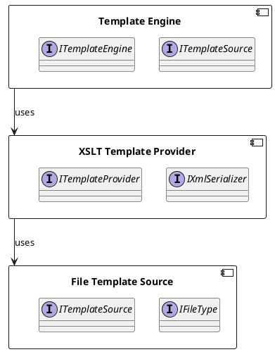

**README**

This repository contains a set of unit tests and implementation for a text templating system, which includes file template sources, TEMplatEEngine, and XSLT template providers.

The system provides a way to generate text output from templates, using various template engines such as XSLT. The template engines can be applied to input data, generating output based on the template definition. The system also includes mechanisms for handling errors, logging, and caching.

**Technical Summary**

The system uses the following design patterns:

* The TemplateEngine class uses the Single Responsibility Principle (SRP) and the Factory method pattern to create instances of template engines.
* The XsltTemplateProvider class uses the Factory method pattern to create instances of XSLT processors.
* The FileTemplateSource class uses the Strategy pattern to handle different file templates.

The system uses the following architectural patterns:

* The system uses a layered architecture, with separate layers for the template engine, template providers, and template sources.
* The system uses a pipeline architecture, where input data is processed through a series of transformations, including XSLT processing.

**Component Diagram**

Note: The above component diagram shows the relationships between the different components, including the Template Engine, XSLT Template Provider, and File Template Source. The arrows represent the dependencies between the components.