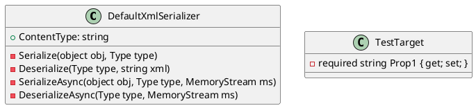

# DefaultXmlSerializer Documentation

## Overview

The `DefaultXmlSerializer` is a class that provides a simple way to serialize and deserialize objects to and from XML. It is a default implementation and may not cover all scenarios, but it provides a good starting point for most use cases.

## Class Diagram

## API

### Constructors

No constructors are provided. The `DefaultXmlSerializer` is a static class, and instances are not required.

### Serialization Methods

* `Serialize(object obj, Type type)`: Serializes the object to XML.
* `SerializeAsync(object obj, Type type, MemoryStream ms)`: Asynchronous version of `Serialize`.

### Deserialization Methods

* `Deserialize(Type type, string xml)`: Deserializes the XML to an object.
* `DeserializeAsync(Type type, MemoryStream ms)`: Asynchronous version of `Deserialize`.

### Properties

* `ContentType`: Returns the content type of the XML (`"text/xml"`).

## Tests

The `DefaultXmlSerializerTests` class provides a set of unit tests that demonstrate the usage of the `DefaultXmlSerializer`.

### Deserialize Tests

* `DeserializeTest_StringType`: Tests deserializing a string into an object.
* `DeserializeTest_StringGeneric`: Tests deserializing a string into an object using a generic type.
* `DeserializeTest_StreamType`: Tests deserializing a stream into an object.
* `DeserializeTest_StreamGeneric`: Tests deserializing a stream into an object using a generic type.
* `DeserializeAsyncTest_StreamType`: Tests asynchronously deserializing a stream into an object.
* `DeserializeAsyncTest_StreamGeneric`: Tests asynchronously deserializing a stream into an object using a generic type.

### Serialize Tests

* `SerializeTest_Type`: Tests serializing an object into a string.
* `SerializeTest_Generic`: Tests serializing an object into a string using a generic type.
* `SerializeAsyncTest_Type`: Tests asynchronously serializing an object into a string.
* `SerializeAsyncTest.Generic`: Tests asynchronously serializing an object into a string using a generic type.

### ContentType Test

* `ContentTypeTest`: Tests the content type of the XML (`"text/xml"`).

## Conclusion

The `DefaultXmlSerializer` provides a simple way to serialize and deserialize objects to and from XML. It is a default implementation and may not cover all scenarios, but it provides a good starting point for most use cases.