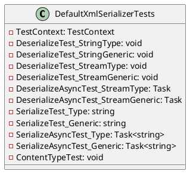

**DefaultXmlSerializerTests Documentation**

### Classes

**DefaultXmlSerializerTests**

* Description: A set of unit tests for the DefaultXmlSerializer class.

**Attributes**

* `TestClass`: Indicates that this class contains test methods.
* `TestMethod`: Indicates that this method is a test method.
* `TestCategory`: Specifies the category of this test.

**Methods**

* `DeserializeTest_StringType()`: Tests deserialization of a string for a non-generic type.
* `DeserializeTest_StringGeneric()`: Tests deserialization of a string for a generic type.
* `DeserializeTest_StreamType()`: Tests deserialization of a stream for a non-generic type.
* `DeserializeTest_StreamGeneric()`: Tests deserialization of a stream for a generic type.
* `DeserializeAsyncTest_StreamType()`: Tests asynchronous deserialization of a stream for a non-generic type.
* `DeserializeAsyncTest_StreamGeneric()`: Tests asynchronous deserialization of a stream for a generic type.
* `SerializeTest_Type()`: Tests serialization of an object for a non-generic type.
* `SerializeTest_Generic()`: Tests serialization of an object for a generic type.
* `SerializeAsyncTest_Type()`: Tests asynchronous serialization of an object for a non-generic type.
* `SerializeAsyncTest_Generic()`: Tests asynchronous serialization of an object for a generic type.
* `ContentTypeTest()`: Tests the content type of the serializer.

**Properties**

* `TestContext`: Provides test context information.

### PlantUML Class Diagram

In this class diagram, `DefaultXmlSerializerTests` is the main class under testing, which contains various test methods for the `DefaultXmlSerializer` class. The class has properties for `TestContext` and methods for deserialization, serialization, and content type testing.