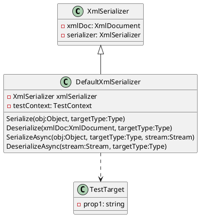

**Readme File**

This repository contains a set of unit tests and source code for a .NET XML serializer library. The library provides functionality for serializing and deserializing objects to and from XML. The tests cover various scenarios, including deserializing objects from strings and streams, and serializing objects to strings and streams.

**Technical Summary**

The library uses a combination of design patterns and architectural patterns to implement the serializing and deserializing functionality.

* **Decorator Pattern**: The `DefaultXmlSerializer` class uses the decorator pattern to decorate the `XmlSerializer` class and add additional functionality, such as the ability to handle async operations.
* **Factory Pattern**: The `DefaultXmlSerializer` class uses the factory pattern to create instances of the `XmlSerializer` class.
* **Single Responsibility Principle**: The `DefaultXmlSerializer` class has a single responsibility, which is to serialize and deserialize objects to and from XML.

**Component Diagram**

Here is a component diagram of the library using PlantUML:

Note: The above diagram is a simplified representation of the library's components and is not intended to be a detailed or exhaustive description of the system.