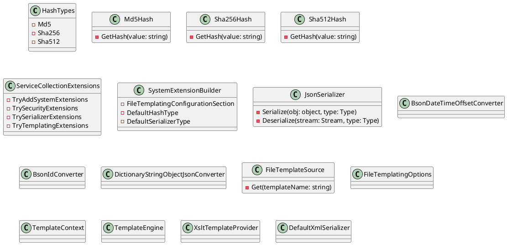

# Eliassen.System Documentation

The Eliassen.System package provides a comprehensive set of classes and utilities for various system-related functionalities. This documentation provides an overview of the package's key components, classes, and interfaces.

### Security.Cryptography

The Security.Cryptography namespace contains classes for cryptographic operations, such as hash algorithms.

* **HashTypes**: Specifies different types of hash algorithms.
	+ **Md5**: Represents the MD5 hash algorithm.
	+ **Sha256**: Represents the SHA-256 hash algorithm.
	+ **Sha512**: Represents the SHA-512 hash algorithm.
* **Md5Hash**: Default hash of input value. Base64 encoded MD5 Hash.
	+ **GetHash(value: string)**: Computes the default hash of the input value using MD5.
* **Sha256Hash**: Default hash of input value. Base64 encoded SHA256 Hash.
	+ **GetHash(value: string)**: Computes the default hash of the input value using SHA256.
* **Sha512Hash**: Default hash of input value. Base64 encoded SHA512 Hash.
	+ **GetHash(value: string)**: Computes the default hash of the input value using SHA512.

### ServiceCollectionExtensions

The ServiceCollectionExtensions class provides methods for adding and configuring system extensions in a Microsoft.Extensions.DependencyInjection interface.

* **TryAddSystemExtensions**: Adds all available extensions to the IOC container.
* **TrySecurityExtensions**: Adds support for shared security extensions.
* **TrySerializerExtensions**: Adds support for shared serializers.
* **TryTemplatingExtensions**: Adds support for shared templating.

### SystemExtensionBuilder

The SystemExtensionBuilder class represents a builder for configuring system extensions.

* **FileTemplatingConfigurationSection**: Gets or sets the configuration section name for file templating options.
* **DefaultHashType**: Gets or sets the default hash type to be used.
* **DefaultSerializerType**: Gets or sets the default serializer type to be used.

### Text.Json

The Text.Json namespace contains classes for JSON serialization and deserialization.

* **JsonSerializer**: Default serializer for JSON.
	+ **Serialize(obj: object, type: Type)**: Serializes an object to a JSON string.
	+ **Deserialize(stream: Stream, type: Type)**: Deserializes a JSON stream to an object of a given type.
* **BsonDateTimeOffsetConverter**: System.Text.Json converter to support BSON DateTimeOffset.
* **BsonIdConverter**: Type converter for System.Text.Json to support BSON ObjectID to JSON safe export/import.
* **DictionaryStringObjectJsonConverter**: Custom JSON converter for dictionaries with string keys and object values.

### Templating

The Templating namespace contains classes for template processing.

* **FileTemplateSource**: Access template from the file system.
	+ **Get(templateName: string)**: Looks up templates from the file system.
* **FileTemplatingOptions**: Configuration settings for file templating engine.
* **TemplateContext**: Represents the context of a template. Provides information about the template and its processing.
* **TemplateEngine**: Generates a templating engine that tries to use the best match for source and provider.
	+ **ApplyAsync**: Applies the template asynchronously to the provided data.
* **XsltTemplateProvider**: Provides template processing using XSLT.

### Xml.Serialization

The Xml.Serialization namespace contains classes for XML serialization and deserialization.

* **DefaultXmlSerializer**: Default XmlSerializer.

### Class Diagram

### Component Model
```plantuml
@startuml
component "Eliassen.System" {
  interface "ISecurityExtensions"
  interface "ISerializer"
  interface "ITemplating"

  class "ServiceCollectionExtensions" implements "ISecurityExtensions"
  class "ServiceCollectionExtensions" implements "ISerializer"
  class "ServiceCollectionExtensions" implements "ITemplating"

  class "SystemExtensionBuilder"

  interface "IHash"
  interface "ISerializer"
  interface "ITemplateEngine"
  interface "ITemplate