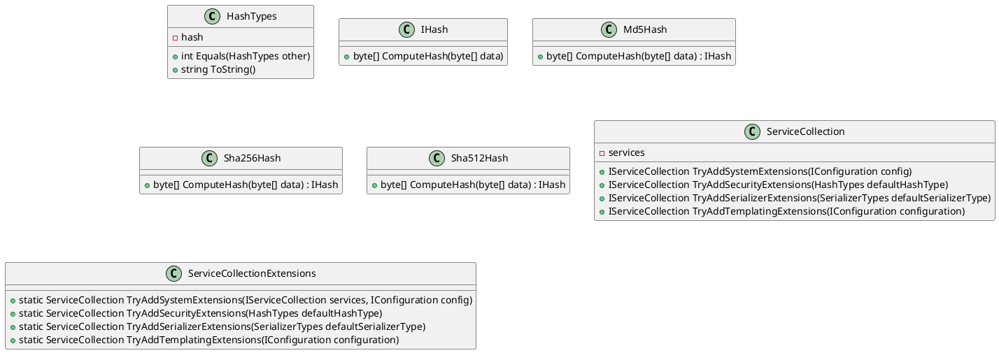
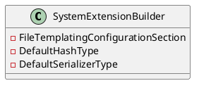
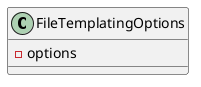
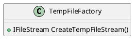

**Class Diagrams using PlantUML**

Here are the class diagrams generated using PlantUML for the provided source code files.

**Eliassen.System**

**SystemExtensionBuilder**

**FileTemplatingOptions**

**TempFileFactory**

These class diagrams represent the classes, relationships, and methods defined in the provided source code files. Note that some classes and relationships may be missing from the diagrams if they are not explicitly mentioned in the source code.